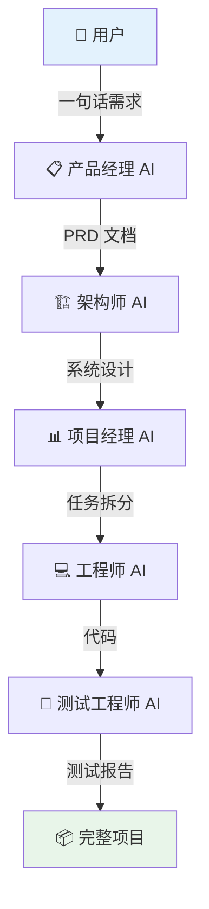
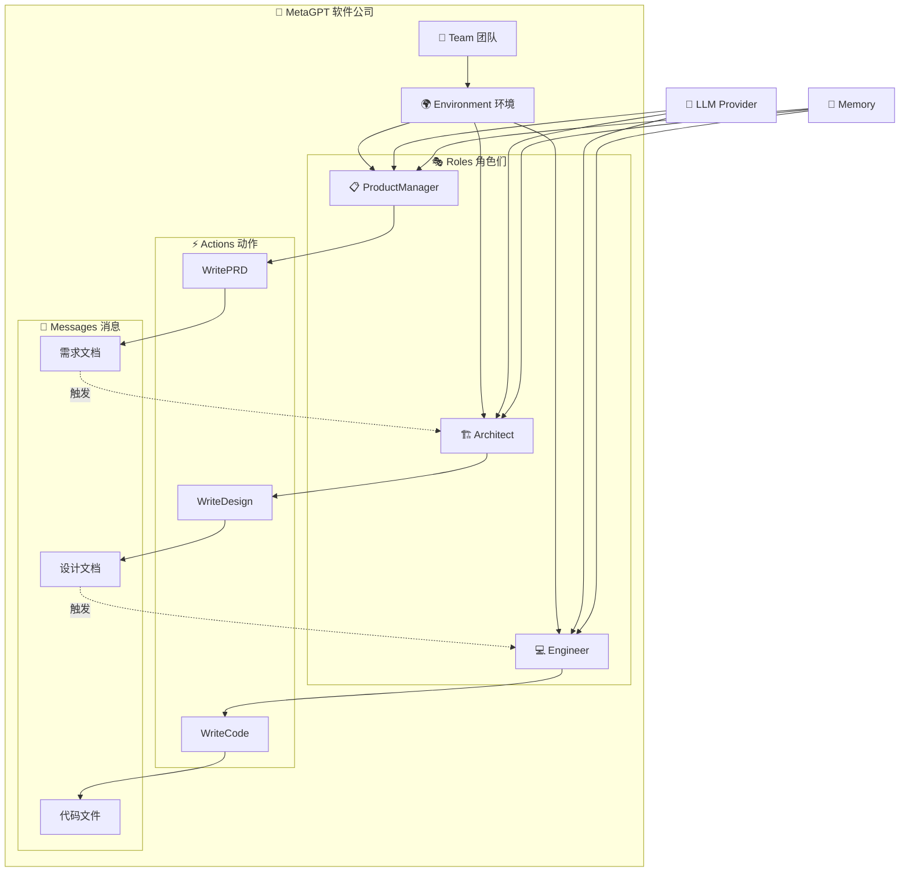
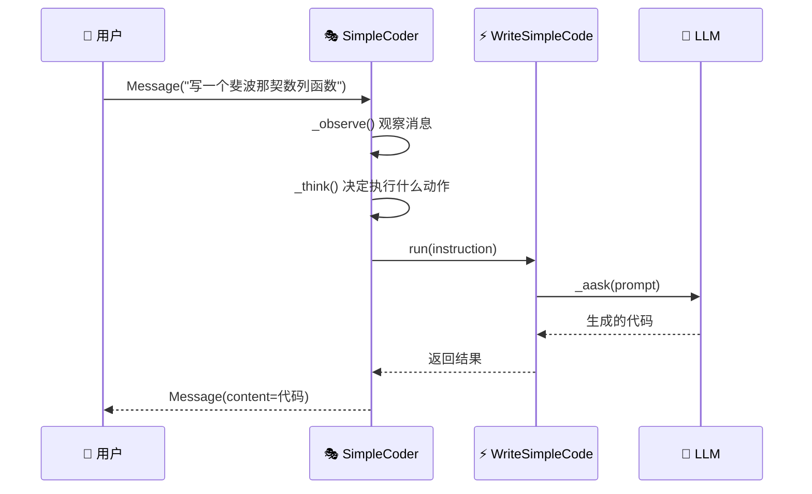
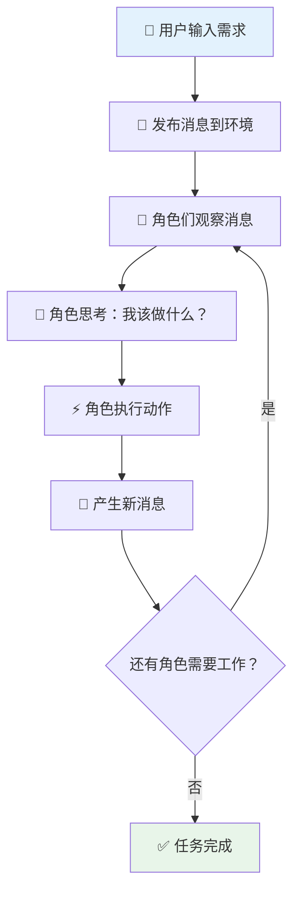

# 📖 第一章：MetaGPT 概述与快速入门

> 🎯 本章目标：了解 MetaGPT 的核心理念，完成安装配置，运行你的第一个多智能体程序。

---

## 1.1 🌟 MetaGPT 是什么？

### 一句话概括

MetaGPT 是一个**多智能体协作框架**，它模拟了一个软件公司的运作方式，让多个 AI 智能体（Agent）分工协作，共同完成复杂任务。

### 通俗比喻 🏢

想象你要开发一个 App，你需要：

1. **产品经理** 📋 — 分析需求，写产品文档
2. **架构师** 🏗️ — 设计系统架构
3. **项目经理** 📊 — 拆分任务，安排排期
4. **程序员** 💻 — 编写代码
5. **测试工程师** 🧪 — 编写测试、检验质量

在传统方式中，你需要雇佣一整个团队。而 MetaGPT 做的事情是：**用 AI 模拟这整个团队**！



### 核心理念：Code = SOP(Team)

MetaGPT 的设计哲学可以用一个公式概括：

> **Code = SOP(Team)**

- **SOP**（Standard Operating Procedure）= 标准操作流程
- **Team** = 团队角色分工

含义：**好的代码来自好的团队流程**。MetaGPT 把软件公司的管理流程（SOP）编码进了框架中，让 AI 智能体按照真实公司的协作方式运转。

### 为什么需要多智能体？🤔

你可能会问：「直接让一个 ChatGPT 写代码不行吗？」

| 方式 | 优势 | 劣势 |
|------|------|------|
| 单个 LLM | 简单直接 | 容易幻觉、缺乏审查、质量不稳定 |
| 多智能体协作 | 分工明确、互相审查、流程可控 | 需要框架支持 |

**类比**：一个人写代码 vs. 一个团队做项目。团队虽然沟通成本高，但产出质量更高、更可控。MetaGPT 正是提供了这个「团队协作」的框架。

---

## 1.2 🏗️ 项目架构概览

在深入学习之前，先对 MetaGPT 的项目结构有个全局认知：

```
MetaGPT/
├── metagpt/                    # 🧠 核心框架代码
│   ├── actions/                # ⚡ 动作定义（写代码、写文档等）
│   ├── roles/                  # 🎭 角色定义（产品经理、工程师等）
│   ├── environment/            # 🌍 环境（智能体运行的「办公室」）
│   ├── provider/               # 🤖 LLM 提供者（OpenAI、Claude 等）
│   ├── memory/                 # 🧠 记忆系统
│   ├── tools/                  # 🔧 工具（搜索、浏览器等）
│   ├── schema.py               # 📐 数据模型定义
│   ├── team.py                 # 👥 团队协作管理
│   ├── context.py              # 🔗 上下文管理
│   └── config2.py              # ⚙️ 配置系统
├── examples/                   # 📂 示例代码
├── config/                     # ⚙️ 配置模板
├── tests/                      # 🧪 测试代码
└── docs/                       # 📚 文档
```

### 核心组件关系图



---

## 1.3 🔧 安装与配置

### 环境要求

- Python 3.9 ~ 3.11（不支持 3.12+）
- 一个 LLM API Key（如 OpenAI API Key）

### 安装步骤

**方式一：pip 安装（推荐）**

```bash
# 创建虚拟环境（推荐）
python -m venv metagpt-env
source metagpt-env/bin/activate  # Linux/Mac
# metagpt-env\Scripts\activate   # Windows

# 安装 MetaGPT
pip install metagpt
```

**方式二：从源码安装（适合开发者）**

```bash
git clone https://github.com/geekan/MetaGPT.git
cd MetaGPT
pip install -e .
```

### 配置 LLM

MetaGPT 支持多种 LLM 提供商。以 OpenAI 为例，创建配置文件：

```bash
# 复制配置模板
cp config/config2.example.yaml ~/.metagpt/config2.yaml
```

编辑 `~/.metagpt/config2.yaml`：

```yaml
llm:
  api_type: "openai"          # LLM 提供商类型
  model: "gpt-4-turbo"        # 模型名称
  base_url: "https://api.openai.com/v1"  # API 地址
  api_key: "sk-your-api-key"  # 你的 API Key
```

> 💡 **小贴士**：MetaGPT 也支持 Azure OpenAI、Anthropic Claude、Google Gemini、Ollama 本地模型等，详见 [第七章](./07-llm-provider.md)。

---

## 1.4 🚀 第一个程序：Hello MetaGPT

让我们从最简单的程序开始——直接调用 LLM：

```python
"""hello_metagpt.py - 最简单的 MetaGPT 程序"""
import asyncio
from metagpt.llm import LLM

async def main():
    # 创建 LLM 实例（自动读取配置）
    llm = LLM()
    
    # 向 LLM 提问
    response = await llm.aask("用一句话介绍 MetaGPT")
    print(f"🤖 回答：{response}")

asyncio.run(main())
```

**代码解读**：

1. `LLM()` — 创建一个大语言模型实例，自动读取 `config2.yaml` 中的配置
2. `llm.aask()` — 异步调用 LLM（`a` 代表 async，`ask` 代表提问）
3. `asyncio.run()` — 运行异步函数

> 🤔 **为什么用 async？** MetaGPT 大量使用异步编程，因为调用 LLM API 是 I/O 密集型操作。异步可以让多个智能体「同时思考」，大大提高效率。就像一个团队里，产品经理写文档时，工程师可以同时在写代码。

---

## 1.5 🎭 第一个智能体：SimpleCoder

让我们创建一个简单的代码生成智能体，体验 MetaGPT 的基本工作模式：

```python
"""simple_coder.py - 第一个自定义智能体"""
import asyncio
from metagpt.actions import Action
from metagpt.roles import Role
from metagpt.schema import Message

# 1️⃣ 定义一个 Action（动作）：生成代码
class WriteSimpleCode(Action):
    """生成简单代码的动作"""
    name: str = "WriteSimpleCode"
    
    async def run(self, instruction: str) -> str:
        # 调用 LLM 生成代码
        prompt = f"请根据以下需求生成 Python 代码，只返回代码：\n{instruction}"
        code = await self._aask(prompt)
        return code

# 2️⃣ 定义一个 Role（角色）：简单程序员
class SimpleCoder(Role):
    """一个简单的代码生成角色"""
    name: str = "小码"
    profile: str = "SimpleCoder"
    goal: str = "根据用户需求生成 Python 代码"
    
    def __init__(self, **kwargs):
        super().__init__(**kwargs)
        # 给角色分配动作
        self.set_actions([WriteSimpleCode])

# 3️⃣ 运行智能体
async def main():
    role = SimpleCoder()
    result = await role.run(Message(content="写一个斐波那契数列函数"))
    print(f"📝 生成的代码：\n{result.content}")

asyncio.run(main())
```

**代码解读**：



**关键概念**：

| 概念 | 类比 | 作用 |
|------|------|------|
| **Action** | 员工的一项技能 | 定义智能体能做什么（如写代码、写文档） |
| **Role** | 一个员工 | 拥有一组技能，根据情况选择使用 |
| **Message** | 工作邮件 | 角色之间传递信息的载体 |

---

## 1.6 📊 MetaGPT 的工作流程

理解 MetaGPT 的整体工作流程，是后续深入学习的基础：



**用「公司例会」来类比**：

1. 🚀 **老板提出需求**：「我要开发一个待办事项 App」
2. 📨 **秘书群发邮件**：把需求发给所有人
3. 👀 **产品经理看到邮件**：「这是我的活儿！」
4. 🧠 **产品经理思考**：「我需要写 PRD」
5. ⚡ **产品经理写 PRD**：调用 LLM 生成产品文档
6. 📨 **产品经理发出 PRD**：新邮件发给所有人
7. 👀 **架构师看到 PRD**：「轮到我了！」
8. 🧠 **架构师思考**：「我需要做系统设计」
9. ... 以此类推，直到所有工作完成

---

## 1.7 📝 本章小结

| 概念 | 说明 |
|------|------|
| MetaGPT | 多智能体协作框架，模拟软件公司 |
| SOP | 标准操作流程，保证协作有序 |
| Action | 智能体的一项能力/技能 |
| Role | 拥有一组 Action 的智能体角色 |
| Message | 角色之间的通信载体 |
| Environment | 角色运行的环境，负责消息路由 |
| Team | 管理多个角色的团队 |

## ➡️ 下一章

准备好了吗？让我们深入了解 MetaGPT 的第一个核心概念 —— [Message 消息系统](./02-message-system.md)！
