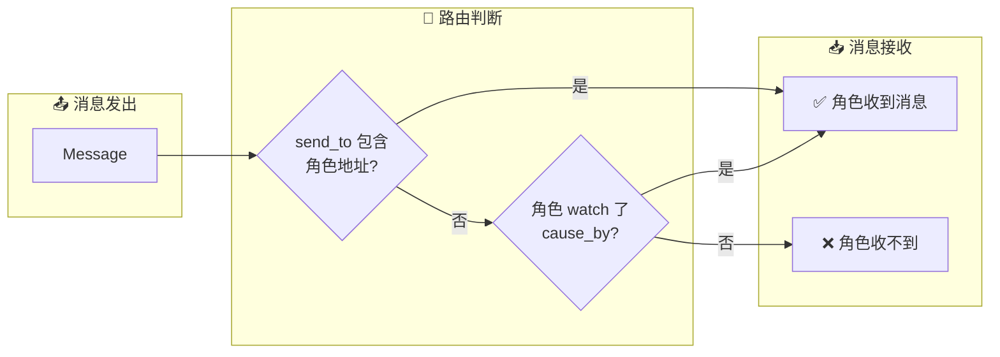
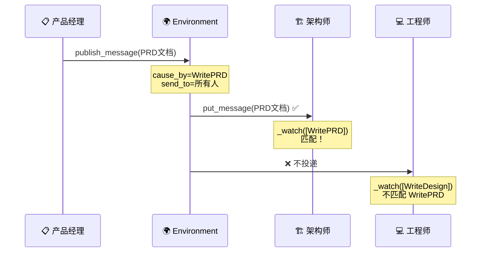
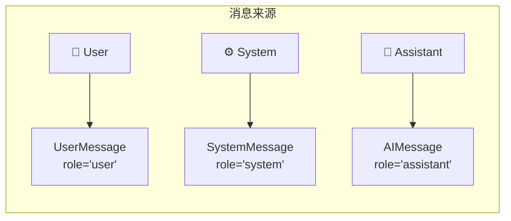
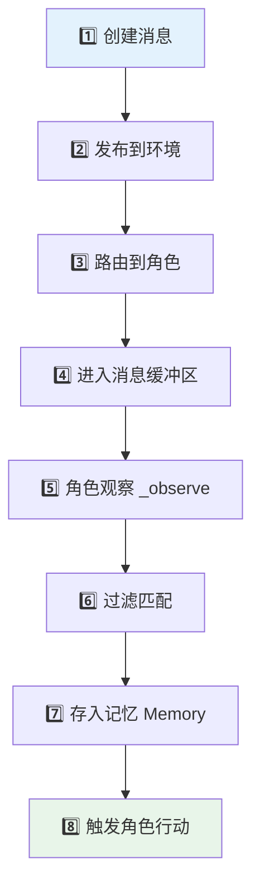
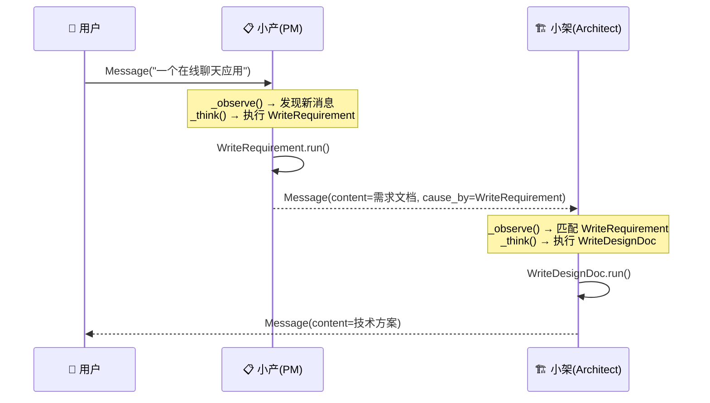

# 📨 第二章：Message 消息系统

> 🎯 本章目标：理解 MetaGPT 中消息（Message）的结构与路由机制，掌握智能体之间的通信方式。

---

## 2.1 💡 为什么消息系统是核心？

在一个真实的团队中，**沟通是协作的基础**。团队成员通过邮件、会议、文档来传递信息。在 MetaGPT 中，**Message** 就是智能体之间的「邮件系统」。

### 通俗比喻 📮

想象一个公司的邮件系统：

- 📧 每封邮件都有 **发件人**、**收件人**、**主题**、**正文**
- 📬 邮件发出后会被投递到对应人的邮箱
- 👀 收到邮件的人可以选择处理或忽略
- 📋 所有邮件都会被存档

MetaGPT 的 Message 正是遵循这个设计。

---

## 2.2 📐 Message 的结构

Message 定义在 `metagpt/schema.py` 中，是 MetaGPT 最核心的数据结构之一：

```python
class Message(BaseModel):
    """MetaGPT 中的消息，是智能体之间通信的基本单位"""
    
    id: str = ""                          # 📌 唯一标识（UUID）
    content: str                          # 📝 消息正文内容
    instruct_content: Optional[BaseModel] = None  # 📊 结构化内容
    role: str = "user"                    # 🎭 角色类型：user/system/assistant
    
    # ---- 路由相关 ----
    cause_by: str = ""                    # ⚡ 由哪个 Action 产生
    sent_from: str = ""                   # 📤 发送者
    send_to: set[str] = {MESSAGE_ROUTE_TO_ALL}  # 📥 接收者
    
    metadata: Dict[str, Any] = {}         # 📋 附加元数据
```

### 字段详解

让我们用一个具体例子来理解每个字段：

```python
from metagpt.schema import Message
from metagpt.actions import WritePRD

# 产品经理写完 PRD 后发出的消息
msg = Message(
    content="## 产品需求文档\n### 1. 项目概述\n...",  # PRD 内容
    role="assistant",                                    # AI 生成的
    cause_by=WritePRD,                                   # 由 WritePRD 动作产生
    sent_from="ProductManager",                          # 产品经理发的
    send_to={"Architect"}                                # 发给架构师
)
```

### 字段类比表

| 字段 | 邮件类比 | 说明 |
|------|---------|------|
| `content` | 邮件正文 | 消息的主要内容 |
| `role` | 发件人类型 | `user`（用户）/ `assistant`（AI）/ `system`（系统） |
| `cause_by` | 邮件主题分类 | 标记消息是由哪个动作产生的 |
| `sent_from` | 发件人地址 | 谁发的 |
| `send_to` | 收件人列表 | 发给谁（支持多人） |
| `instruct_content` | 邮件附件 | 结构化的附加数据 |
| `metadata` | 邮件标签/备注 | 额外的元信息 |

---

## 2.3 🔀 消息路由机制

消息路由是 MetaGPT 多智能体协作的关键。它决定了：**哪个角色能接收到哪些消息**。

### 路由规则



### 三种路由方式

**1️⃣ 广播模式（默认）**

```python
# 发给所有人
msg = Message(
    content="项目启动了！",
    send_to={MESSAGE_ROUTE_TO_ALL}  # 特殊标记：发给所有角色
)
```

> 📢 类比：群发邮件。就像老板在全员群里发通知。

**2️⃣ 定向发送**

```python
# 只发给特定角色
msg = Message(
    content="请设计系统架构",
    send_to={"Architect", "TechLead"}  # 只发给架构师和技术负责人
)
```

> 📧 类比：发给特定同事的邮件。

**3️⃣ 基于 Action 的订阅**

```python
# 角色可以「订阅」特定 Action 产生的消息
class Architect(Role):
    def __init__(self, **kwargs):
        super().__init__(**kwargs)
        self._watch([WritePRD])  # 👀 订阅 WritePRD 产生的消息
```

> 📰 类比：订阅特定类型的邮件。架构师只关心 PRD 文档，不关心测试报告。

### 路由流程图



---

## 2.4 📊 结构化消息：instruct_content

有时候，纯文本的 `content` 不够用。比如 PRD 文档有固定的格式和字段。这时候就需要 `instruct_content`。

### 为什么需要结构化？

```python
# ❌ 纯文本不好解析
msg.content = """
项目名称：待办App
用户故事：作为用户，我想...
竞品分析：...
"""

# ✅ 结构化数据方便提取
msg.instruct_content = PRDModel(
    project_name="待办App",
    user_stories=["作为用户，我想添加待办事项", ...],
    competitive_analysis=[...]
)
```

### 使用示例

```python
# 创建结构化消息
msg = Message.create_instruct_value(
    kvs={
        "project_name": "待办App",
        "features": ["添加任务", "删除任务", "标记完成"]
    },
    class_name="PRDOutput"
)
```

> 💡 **设计原理**：`content` 用于 LLM 的自然语言交流，`instruct_content` 用于程序之间的结构化数据传递。两者并存，各取所长。

---

## 2.5 🏷️ Message 的分类

MetaGPT 提供了几种预定义的消息类型：

```python
# 1. 用户消息 - 来自人类用户
user_msg = UserMessage(content="帮我写一个计算器")

# 2. 系统消息 - 系统指令
sys_msg = SystemMessage(content="你是一个专业的架构师")

# 3. AI 消息 - AI 助手生成
ai_msg = AIMessage(content="好的，我来为你设计架构...")
```

### 消息类型对照



这三种类型对应了 LLM API 中的标准角色（`user`、`system`、`assistant`），保证与各种 LLM 的兼容性。

---

## 2.6 🔄 消息的生命周期

一条消息从创建到被处理，经历以下生命周期：



**详细流程**：

1. **创建消息**：某个 Action 执行完毕，产生结果消息
2. **发布到环境**：通过 `env.publish_message(msg)` 发布
3. **路由到角色**：Environment 根据 `send_to` 和角色的订阅（`_watch`）判断该发给谁
4. **进入缓冲区**：匹配的角色的 `msg_buffer` 接收消息
5. **角色观察**：角色调用 `_observe()` 读取缓冲区
6. **过滤匹配**：检查 `cause_by` 是否在自己的 `watch` 列表中
7. **存入记忆**：有效消息存入角色的 Memory
8. **触发行动**：角色根据新消息决定下一步行动

---

## 2.7 💻 实战：自定义消息传递

下面通过一个完整示例，展示消息在多个角色之间的流转：

```python
"""message_demo.py - 消息传递演示"""
import asyncio
from metagpt.actions import Action
from metagpt.roles import Role
from metagpt.schema import Message
from metagpt.team import Team
from metagpt.environment import Environment

# 📝 写需求的动作
class WriteRequirement(Action):
    name: str = "WriteRequirement"
    
    async def run(self, topic: str) -> str:
        prompt = f"请用 3 句话描述这个项目的核心需求：{topic}"
        return await self._aask(prompt)

# 📐 写设计的动作
class WriteDesignDoc(Action):
    name: str = "WriteDesignDoc"
    
    async def run(self, requirement: str) -> str:
        prompt = f"基于以下需求，写一份简短的技术方案：\n{requirement}"
        return await self._aask(prompt)

# 📋 产品经理角色
class SimpleProductManager(Role):
    name: str = "小产"
    profile: str = "ProductManager"
    
    def __init__(self, **kwargs):
        super().__init__(**kwargs)
        self.set_actions([WriteRequirement])
        # 💡 不需要 _watch，因为第一个接收用户消息

# 🏗️ 架构师角色  
class SimpleArchitect(Role):
    name: str = "小架"
    profile: str = "Architect"
    
    def __init__(self, **kwargs):
        super().__init__(**kwargs)
        self.set_actions([WriteDesignDoc])
        self._watch([WriteRequirement])  # 👀 订阅产品经理的输出

# 🚀 运行
async def main():
    team = Team()
    team.hire([SimpleProductManager(), SimpleArchitect()])
    team.run_project("一个在线聊天应用")
    await team.run(n_round=3)

asyncio.run(main())
```

**消息流转过程**：



---

## 2.8 📝 本章小结

| 概念 | 说明 |
|------|------|
| **Message** | 智能体之间通信的基本单位 |
| **content** | 消息的文本内容 |
| **cause_by** | 产生该消息的 Action |
| **send_to** | 消息的目标接收者 |
| **instruct_content** | 结构化的附加数据 |
| **消息路由** | 基于 send_to 和 _watch 的匹配机制 |
| **消息缓冲** | 每个角色有独立的 msg_buffer |

### 设计亮点 ✨

1. **解耦通信** — 角色之间不直接调用，通过消息松耦合
2. **灵活路由** — 支持广播、定向、订阅三种模式
3. **可追溯** — 每条消息记录了来源（cause_by）和发送者（sent_from）
4. **双模内容** — content + instruct_content 兼顾灵活性和结构化

## ➡️ 下一章

消息只是通信载体，真正执行工作的是 **Action（动作）**。让我们进入 [第三章：Action 动作系统](./03-action-system.md)！
