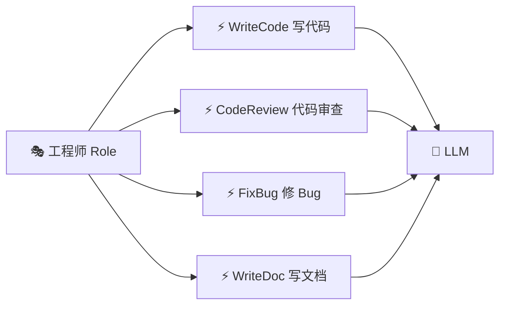
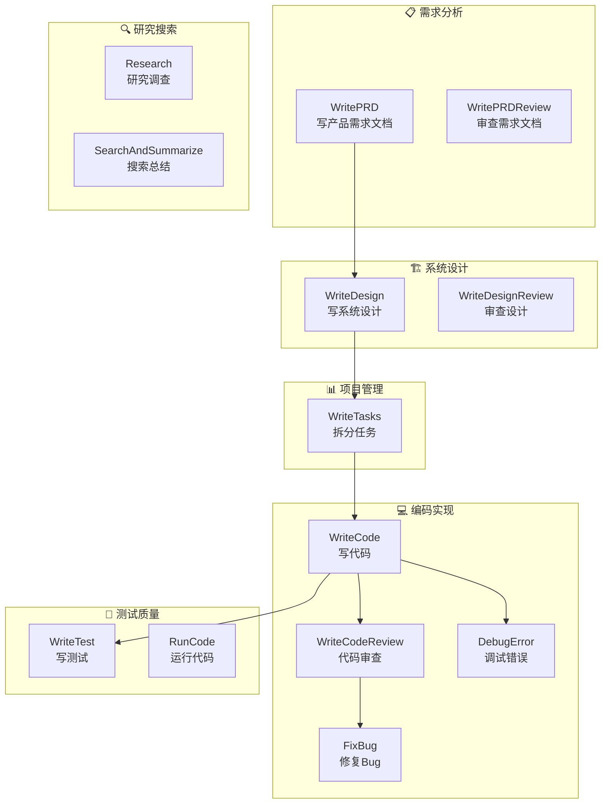
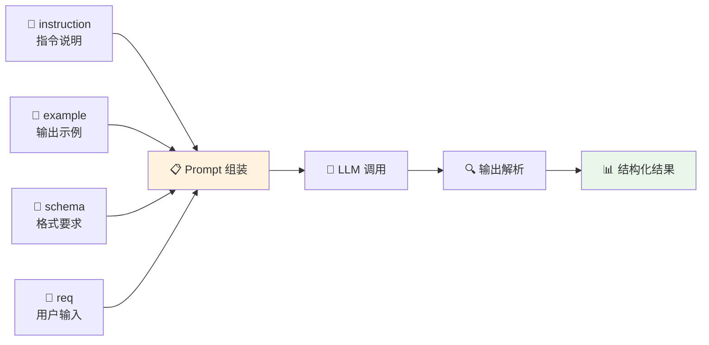
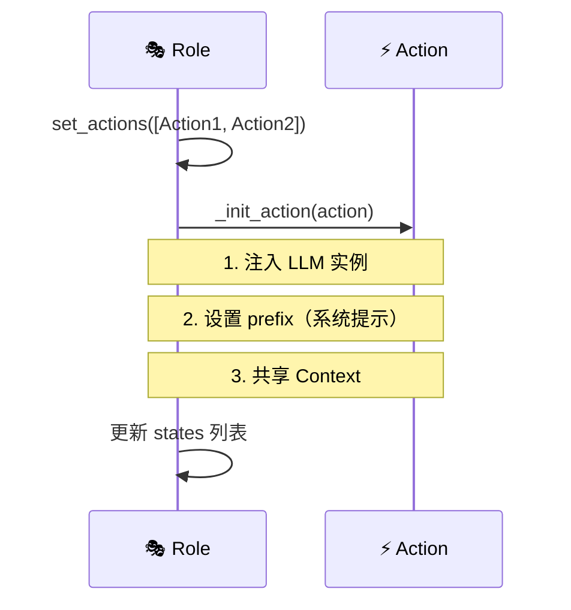
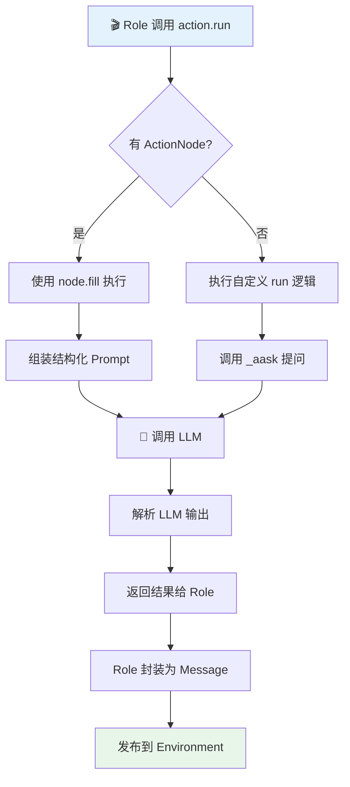
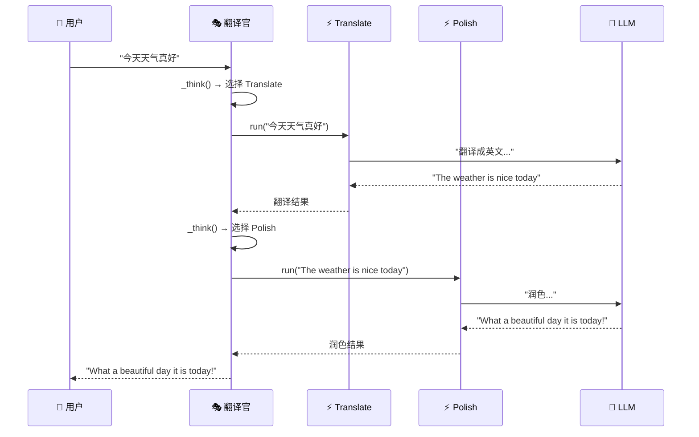

# ⚡ 第三章：Action 动作系统

> 🎯 本章目标：理解 Action 的定义与执行机制，掌握 ActionNode 结构化输出，学会创建自定义 Action。

---

## 3.1 💡 什么是 Action？

如果说 **Role（角色）** 是公司里的员工，那 **Action（动作）** 就是员工掌握的**具体技能**。

### 通俗比喻 🛠️

想象一个工程师：
- 他会的技能（Action）：写代码、代码审查、修 Bug、写文档
- 面对不同任务，他会选择使用不同的技能



**核心理解**：Action 是对 LLM 的一次有目的的调用，它把「给 LLM 发什么 prompt、如何解析结果」封装成了一个可复用的单元。

---

## 3.2 📐 Action 的结构

Action 定义在 `metagpt/actions/action.py`，它的核心结构很简洁：

```python
class Action(SerializationMixin, ContextMixin, BaseModel):
    """所有动作的基类"""
    
    name: str = ""                        # 动作名称
    i_context: Union[dict, str, None] = "" # 输入上下文
    prefix: str = ""                       # 系统提示前缀
    desc: str = ""                         # 动作描述
    node: ActionNode = None                # 结构化动作节点（可选）
    llm_name_or_type: Optional[str] = None # 指定使用哪个 LLM
    
    async def run(self, *args, **kwargs):
        """执行动作 — 子类需要重写这个方法"""
        # 如果配置了 node，使用 ActionNode 执行
        if self.node:
            return await self.node.fill(req=..., llm=self.llm)
        raise NotImplementedError
    
    async def _aask(self, prompt: str, system_msgs=None) -> str:
        """向 LLM 提问的核心方法"""
        # 自动注入系统提示前缀
        if system_msgs is None and self.prefix:
            system_msgs = [self.prefix]
        return await self.llm.aask(prompt, system_msgs)
```

### 核心方法解析

| 方法 | 作用 | 类比 |
|------|------|------|
| `run()` | 执行动作的主方法，子类必须重写 | 员工「执行」一项技能 |
| `_aask()` | 向 LLM 提问 | 员工在脑中「思考」 |
| `set_prefix()` | 设置系统提示 | 给员工一个「角色设定」 |

---

## 3.3 🔨 创建自定义 Action

### 最简单的 Action

```python
from metagpt.actions import Action

class SayHello(Action):
    """最简单的 Action：打招呼"""
    name: str = "SayHello"
    
    async def run(self, name: str) -> str:
        prompt = f"请用一种热情有趣的方式和 {name} 打招呼"
        response = await self._aask(prompt)
        return response
```

### 带模板的 Action

实际应用中，Action 通常使用 **Prompt 模板**来规范 LLM 的输出：

```python
class WriteUserStory(Action):
    """编写用户故事"""
    name: str = "WriteUserStory"
    
    PROMPT_TEMPLATE: str = """
    ## 任务
    请根据以下项目描述，编写 3-5 个用户故事（User Story）。
    
    ## 项目描述
    {project_desc}
    
    ## 输出格式
    请严格按以下格式输出每个用户故事：
    - 作为【角色】，我想要【功能】，以便【价值】
    
    ## 输出
    """
    
    async def run(self, project_desc: str) -> str:
        prompt = self.PROMPT_TEMPLATE.format(project_desc=project_desc)
        return await self._aask(prompt)
```

> 💡 **设计原理**：为什么用模板？因为 LLM 的输出质量很大程度取决于 Prompt 的质量。模板化可以保证每次调用都有一致、高质量的输入。

### 使用 instruction 参数快速创建

如果 Action 逻辑简单，可以直接用 `instruction` 参数：

```python
# 不用定义子类！直接用参数创建
action = Action(name="Summarize", instruction="请总结以下内容的要点")
```

这背后的机制是：

```python
# Action 的 __init__ 中
@model_validator(mode="before")
def _init_with_instruction(cls, values):
    if "instruction" in values:
        # 自动创建 ActionNode
        name = values.get("name", cls.__name__)
        node = ActionNode(
            key=name,
            expected_type=str,
            instruction=values.pop("instruction"),
            example=""
        )
        values["node"] = node
    return values
```

---

## 3.4 📦 内置 Action 一览

MetaGPT 内置了 40+ 个 Action，覆盖软件开发的各个环节：



### 关键 Action 详解

**WritePRD - 写产品需求文档**

```python
class WritePRD(Action):
    """产品经理的核心动作：分析需求，生成 PRD"""
    
    async def run(self, requirements, search_info=""):
        # 1. 组装上下文
        context = CONTEXT_TEMPLATE.format(
            project_name=self.project_name,
            requirements=requirements,
            search_info=search_info
        )
        # 2. 使用 ActionNode 生成结构化的 PRD
        prd = await self.node.fill(req=context, llm=self.llm)
        return prd
```

**WriteCode - 写代码**

```python
class WriteCode(Action):
    """工程师的核心动作：根据设计文档和任务编写代码"""
    
    async def run(self, coding_context: CodingContext):
        # 1. 获取设计文档、API 定义、任务描述
        # 2. 组装 prompt，包含依赖信息
        # 3. 调用 LLM 生成代码
        # 4. 解析代码块并返回
        code = await self._aask(prompt)
        return code
```

---

## 3.5 🌳 ActionNode：结构化输出的利器

当我们需要 LLM 输出**结构化数据**（如 JSON、特定格式的文档）时，直接用 `_aask()` 很难保证格式。这时候就需要 **ActionNode**。

### 通俗理解 📝

想象你让实习生写报告：

- ❌ 直接说「写个报告」→ 格式千奇百怪
- ✅ 给他一个**模板** + **示例** + **要求** → 输出格式统一

ActionNode 就是这个「模板 + 示例 + 要求」的封装。

### ActionNode 的结构

```python
class ActionNode:
    key: str           # 节点名称（如 "PRD"）
    expected_type: str # 期望的输出类型（如 str, list, dict）
    instruction: str   # 详细的指令说明
    example: str       # 输出示例
    schema: str        # 输出格式要求（json/xml/raw）
```

### 使用示例

```python
# 定义一个结构化的输出节点
REVIEW_NODE = ActionNode(
    key="CodeReview",
    expected_type=str,
    instruction="""请审查以下代码，输出审查结果。
    包含以下方面：
    1. 代码质量（1-10分）
    2. 存在的问题
    3. 改进建议
    """,
    example="""
    {
        "quality_score": 8,
        "issues": ["变量命名不规范", "缺少错误处理"],
        "suggestions": ["使用 snake_case 命名", "添加 try-except"]
    }
    """
)

# 在 Action 中使用
class ReviewCode(Action):
    name: str = "ReviewCode"
    node: ActionNode = REVIEW_NODE
    
    async def run(self, code: str):
        # node.fill() 会自动：
        # 1. 组装带格式要求的 prompt
        # 2. 调用 LLM
        # 3. 解析输出为结构化数据
        result = await self.node.fill(req=code, llm=self.llm)
        return result
```

### ActionNode 的工作原理



---

## 3.6 🔗 Action 与 Role 的关系

Action 不能独立运行，它需要被 Role（角色）「拥有」和「调用」：

```python
class MyRole(Role):
    def __init__(self, **kwargs):
        super().__init__(**kwargs)
        # 给角色分配 Action（技能）
        self.set_actions([
            WriteUserStory,    # 技能1：写用户故事
            WriteDesignDoc,    # 技能2：写设计文档
            WriteCode          # 技能3：写代码
        ])
```

### Action 初始化过程

当 Action 被分配给 Role 时，会经历以下初始化：



```python
# Role._init_action() 的简化逻辑
def _init_action(self, action):
    # 共享上下文
    action.set_context(self.context)
    # 设置系统提示（告诉 LLM "你是一个XX角色"）
    action.set_prefix(self._get_prefix())
    # 如果没有指定 LLM，使用角色的 LLM
    if not action.llm:
        action.llm = self.llm
```

> 💡 **设计原理**：为什么 Action 不自带 LLM？因为同一个 Action 可能被不同的 Role 使用，而不同 Role 可能用不同的 LLM（如产品经理用 GPT-4，测试工程师用 GPT-3.5）。通过依赖注入，Action 保持了灵活性。

---

## 3.7 ⚙️ Action 的执行流程



---

## 3.8 🎯 实战：多步骤 Action 组合

一个实际的例子：创建一个翻译 + 润色的 Action 组合：

```python
from metagpt.actions import Action
from metagpt.roles import Role
from metagpt.schema import Message

# 第一步：翻译
class Translate(Action):
    name: str = "Translate"
    language: str = "English"
    
    async def run(self, text: str) -> str:
        prompt = f"请将以下中文翻译成{self.language}：\n{text}"
        return await self._aask(prompt)

# 第二步：润色
class Polish(Action):
    name: str = "Polish"
    
    async def run(self, text: str) -> str:
        prompt = f"""请润色以下英文文本，使其更加自然流畅、专业：
        
原文：{text}

要求：
1. 保持原意不变
2. 使用更地道的英语表达
3. 修正任何语法错误

润色后的文本："""
        return await self._aask(prompt)

# 组合角色：翻译官
class Translator(Role):
    name: str = "小翻"
    profile: str = "Translator"
    goal: str = "将中文翻译成优美的英文"
    
    def __init__(self, **kwargs):
        super().__init__(**kwargs)
        self.set_actions([Translate, Polish])
        # 按顺序执行：先翻译，再润色
        self._set_react_mode("by_order")
```

**执行流程**：



---

## 3.9 📝 本章小结

| 概念 | 说明 |
|------|------|
| **Action** | 对 LLM 的一次有目的的调用，封装了 prompt 和解析逻辑 |
| **_aask()** | Action 向 LLM 提问的核心方法 |
| **ActionNode** | 结构化输出工具，通过模板+示例保证输出格式 |
| **instruction** | 快速创建简单 Action 的参数 |
| **set_prefix()** | 设置 Action 的系统提示（角色设定） |

### 设计亮点 ✨

1. **最小化抽象** — Action 基类非常简洁，只需重写 `run()` 方法
2. **依赖注入** — LLM 和 Context 由 Role 注入，保持灵活
3. **结构化输出** — ActionNode 解决了 LLM 输出格式不可控的痛点
4. **可组合** — 多个 Action 可以组合成复杂的工作流

## ➡️ 下一章

Action 定义了「做什么」，但「谁来做」「什么时候做」由 **Role（角色）** 决定。让我们进入 [第四章：Role 角色系统](./04-role-system.md)！
