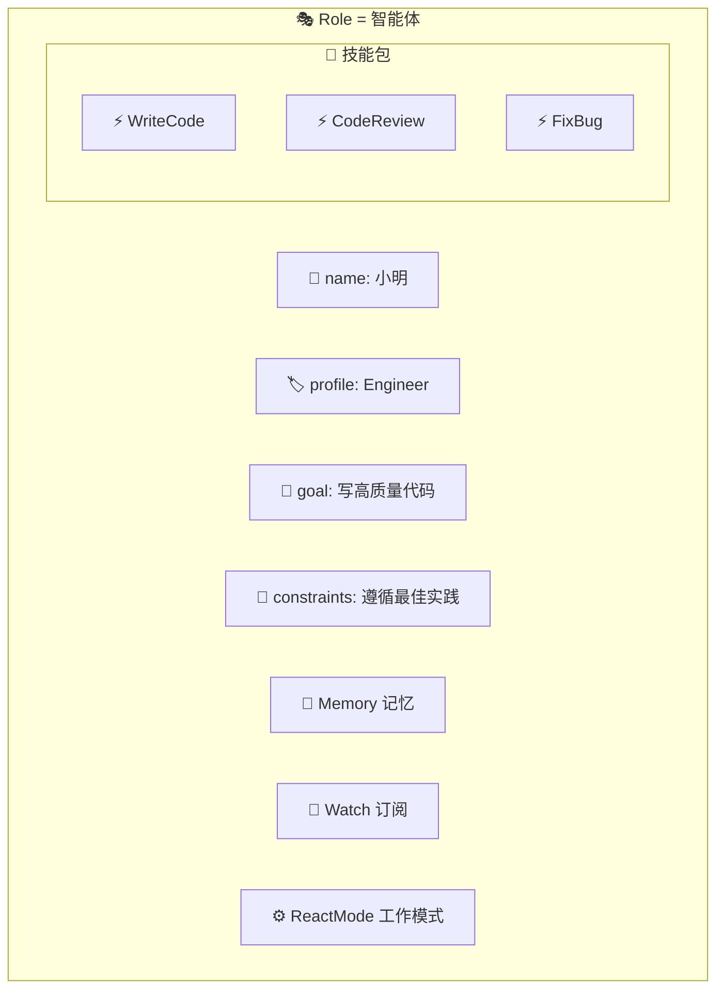
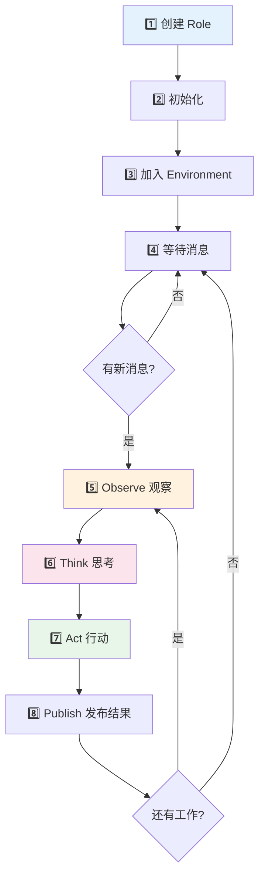
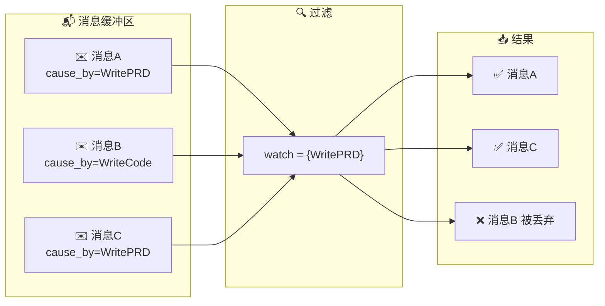
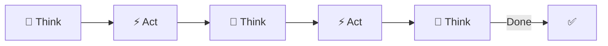
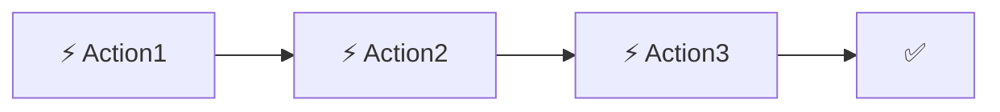
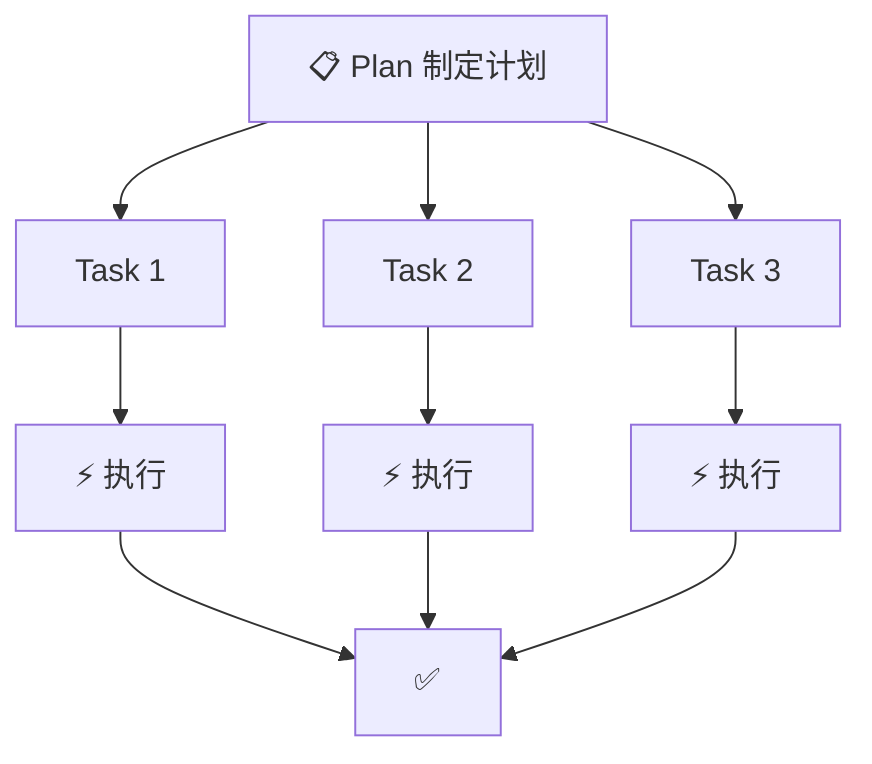
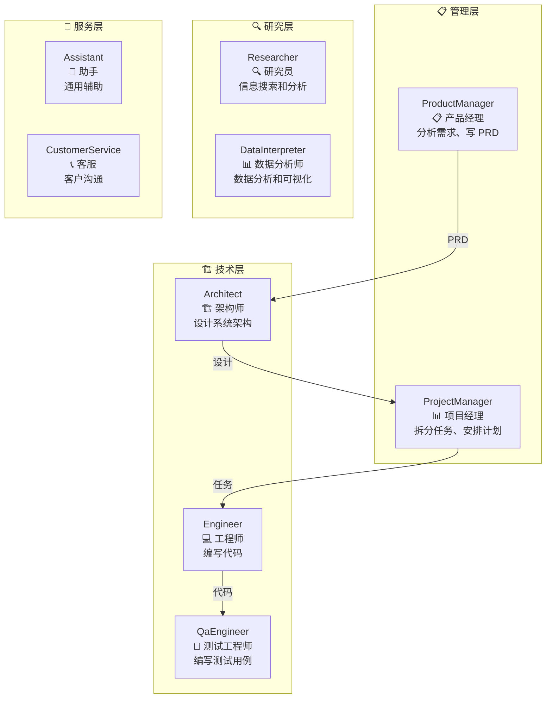
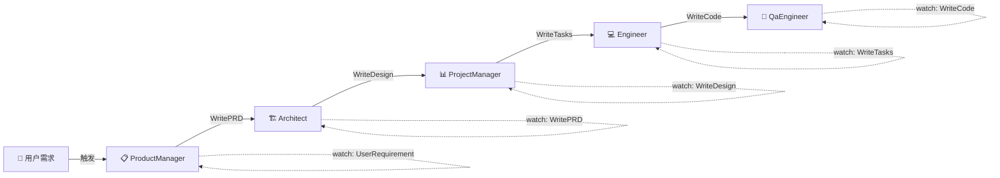
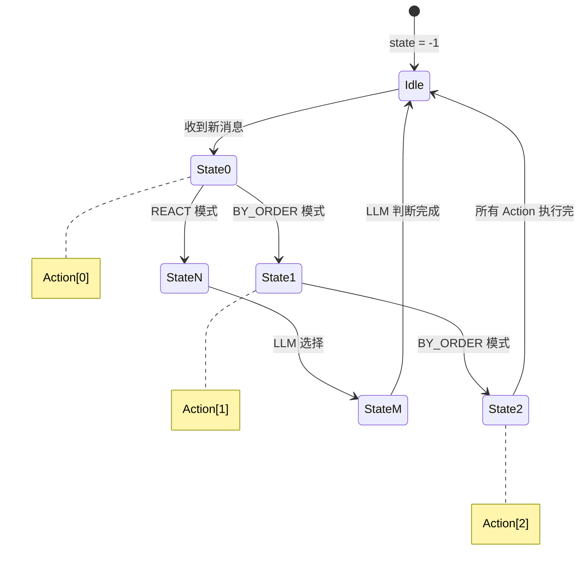

# 🎭 第四章：Role 角色系统

> 🎯 本章目标：深入理解 Role 的生命周期、状态机、反应模式，掌握自定义角色的创建方法。

---

## 4.1 💡 什么是 Role？

**Role（角色）** 是 MetaGPT 中最核心的概念——它代表一个**智能体（Agent）**。

### 通俗比喻 🧑‍💼

Role 就像公司里的一个**员工**：

- 有自己的**名字**和**职位**（name, profile）
- 有明确的**工作目标**（goal）
- 遵守一定的**工作规范**（constraints）
- 掌握一系列**工作技能**（actions）
- 有自己的**记忆力**（memory）
- 知道该**关注谁的工作成果**（watch）
- 按照一定的**工作方式**做事（react_mode）



---

## 4.2 📐 Role 的完整结构

Role 定义在 `metagpt/roles/role.py`，约 600 行代码：

```python
class Role(BaseRole, SerializationMixin, ContextMixin, BaseModel):
    """智能体角色基类"""
    
    # ---- 基本信息 ----
    name: str = ""            # 角色名称，如 "Alice"
    profile: str = ""         # 角色定义，如 "Engineer"
    goal: str = ""            # 工作目标
    constraints: str = ""     # 约束条件
    desc: str = ""            # 自定义描述
    is_human: bool = False    # 是否由人类控制
    
    # ---- 能力配置 ----
    actions: list[Action] = []   # 可执行的动作列表
    states: list[str] = []       # 状态列表（与 actions 对应）
    
    # ---- 运行时上下文 ----
    rc: RoleContext              # 运行时上下文（见下文）
    
    # ---- 高级功能 ----
    enable_memory: bool = True   # 启用记忆
    role_id: str = ""            # 唯一ID
    addresses: set[str] = set()  # 消息地址
    planner: Planner             # 任务规划器
```

### RoleContext：角色的「工作台」

```python
class RoleContext(BaseModel):
    """角色的运行时上下文——角色工作的"桌面"
    
    想象员工的工位：
    - 电脑上有待处理的邮件（msg_buffer）
    - 大脑里有之前的工作记忆（memory）
    - 手边有正在处理的任务（todo）
    - 有自己的工作状态（state）
    """
    
    env: BaseEnvironment = None        # 所在的环境
    msg_buffer: MessageQueue           # 📬 消息缓冲队列
    memory: Memory                     # 🧠 长期记忆
    working_memory: Memory             # 📋 工作记忆
    state: int = -1                    # 🔢 当前状态（-1 = 空闲）
    todo: Action = None                # ⚡ 当前要执行的动作
    watch: set[str] = set()            # 👀 订阅的 Action 类型
    news: list[Message] = []           # 📰 最新消息
    react_mode: RoleReactMode = REACT  # ⚙️ 反应模式
    max_react_loop: int = 1            # 🔄 最大反应轮次
```

---

## 4.3 🔄 Role 的生命周期

一个 Role 从创建到完成工作，经历以下完整的生命周期：



### 核心循环：Observe → Think → Act

这是 MetaGPT 智能体的核心工作循环，类似于人类的**感知 → 思考 → 行动**：

```python
async def run(self, with_message=None):
    """角色的主循环"""
    
    # 如果有外部消息，放入缓冲区
    if with_message:
        self.put_message(with_message)
    
    # 1. 👀 Observe：观察环境中的新消息
    if not await self._observe():
        return  # 没有新消息就不工作
    
    # 2. 🧠 + ⚡ React：思考并行动
    response = await self.react()
    
    # 3. 📨 Publish：发布结果
    self.publish_message(response)
    
    return response
```

---

## 4.4 👀 Observe：观察阶段

```python
async def _observe(self) -> int:
    """观察环境，获取新消息"""
    
    # 1. 从消息缓冲区取出所有消息
    news = self.rc.msg_buffer.pop_all()
    
    # 2. 过滤：只保留自己订阅（watch）的消息
    news = [
        msg for msg in news 
        if msg.cause_by in self.rc.watch  # cause_by 匹配 watch 列表
    ]
    
    # 3. 去重：跳过已经处理过的消息
    old_messages = self.rc.memory.get()
    news = [msg for msg in news if msg.id not in old_message_ids]
    
    # 4. 存入记忆和工作记忆
    for msg in news:
        self.rc.memory.add(msg)
        self.rc.working_memory.add(msg)
    
    # 5. 更新最新消息列表
    self.rc.news = news
    
    return len(news)  # 返回新消息数量
```

### 观察过程图解



> 💡 **设计原理**：为什么要过滤？在多智能体系统中，环境里充斥着大量消息。如果每个角色都处理所有消息，会浪费大量 LLM 调用。通过 `_watch` 机制，每个角色只关注自己需要的信息，就像员工只看与自己工作相关的邮件。

---

## 4.5 🧠 Think：思考阶段

Think 阶段决定角色**接下来要做什么**——选择哪个 Action 来执行。

```python
async def _think(self) -> bool:
    """思考下一步行动"""
    
    if len(self.actions) == 1:
        # 只有一个 Action，直接选它
        self.set_todo(self.actions[0])
        return True
    
    # 根据 react_mode 选择策略
    if self.rc.react_mode == RoleReactMode.BY_ORDER:
        # 按顺序执行
        self._select_next_action_by_order()
    elif self.rc.react_mode == RoleReactMode.REACT:
        # 让 LLM 来决定
        await self._select_action_by_llm()
    elif self.rc.react_mode == RoleReactMode.PLAN_AND_ACT:
        # 先规划再执行
        await self._plan_and_act()
    
    return bool(self.rc.todo)
```

---

## 4.6 ⚙️ 三种反应模式

MetaGPT 提供三种不同的反应模式，适用于不同场景：

### 1️⃣ REACT 模式（默认）



**特点**：每次行动前都让 LLM 重新思考下一步做什么。

**适用场景**：需要灵活决策的复杂任务，比如根据代码审查结果决定是修改代码还是提交。

**类比**：一个经验丰富的员工，每完成一步都会根据情况判断下一步做什么。

```python
class FlexibleWorker(Role):
    def __init__(self, **kwargs):
        super().__init__(**kwargs)
        self.set_actions([Analyze, Design, Implement])
        self._set_react_mode("react", max_react_loop=5)
```

### 2️⃣ BY_ORDER 模式



**特点**：按照 Action 列表的顺序依次执行，不需要 LLM 决策。

**适用场景**：步骤固定的流水线任务，如「翻译 → 润色 → 格式化」。

**类比**：流水线工人，按固定步骤操作。

```python
class PipelineWorker(Role):
    def __init__(self, **kwargs):
        super().__init__(**kwargs)
        self.set_actions([Step1, Step2, Step3])
        self._set_react_mode("by_order")  # 按顺序执行
```

### 3️⃣ PLAN_AND_ACT 模式



**特点**：先让 LLM 制定完整计划，然后逐步执行。

**适用场景**：复杂的大任务，需要先规划再实施。

**类比**：项目经理先写 Gantt 图，再按计划推进。

```python
class PlannerWorker(Role):
    def __init__(self, **kwargs):
        super().__init__(**kwargs)
        self.set_actions([WriteCode])
        self._set_react_mode("plan_and_act")
```

### 三种模式对比

| 模式 | 决策方式 | LLM 调用 | 灵活性 | 适用场景 |
|------|---------|---------|--------|---------|
| REACT | LLM 动态决策 | 多（每步都思考） | 高 | 复杂、不确定的任务 |
| BY_ORDER | 固定顺序 | 少（无需决策） | 低 | 步骤明确的流水线 |
| PLAN_AND_ACT | 先规划后执行 | 中等 | 中等 | 需要整体规划的任务 |

---

## 4.7 ⚡ Act：行动阶段

```python
async def _act(self) -> Message:
    """执行当前动作"""
    
    # 1. 获取当前要执行的 Action
    todo = self.rc.todo
    
    # 2. 准备输入（从工作记忆中获取）
    context = self.rc.working_memory.get()
    
    # 3. 执行 Action
    response = await todo.run(context)
    
    # 4. 封装为 Message
    msg = Message(
        content=response,
        role="assistant",
        cause_by=type(todo),       # 标记由哪个 Action 产生
        sent_from=self.profile,    # 标记发送者
    )
    
    # 5. 清空工作记忆
    self.rc.working_memory.clear()
    
    return msg
```

---

## 4.8 🏗️ 内置角色一览

MetaGPT 提供了 15+ 个内置角色：



### 各角色的 Watch 关系



---

## 4.9 🛠️ 创建自定义 Role

### 基础模板

```python
from metagpt.roles import Role
from metagpt.actions import Action
from metagpt.schema import Message

class MyAction(Action):
    name: str = "MyAction"
    
    async def run(self, context: str) -> str:
        return await self._aask(f"请处理：{context}")

class MyRole(Role):
    name: str = "小助"
    profile: str = "MyAssistant"
    goal: str = "帮助用户完成任务"
    constraints: str = "回答要简洁明了"
    
    def __init__(self, **kwargs):
        super().__init__(**kwargs)
        self.set_actions([MyAction])
```

### 高级自定义：重写核心方法

```python
class AdvancedRole(Role):
    name: str = "高级助手"
    profile: str = "AdvancedAssistant"
    
    def __init__(self, **kwargs):
        super().__init__(**kwargs)
        self.set_actions([ActionA, ActionB, ActionC])
        self._watch([SomeExternalAction])  # 订阅外部动作
    
    async def _observe(self) -> int:
        """自定义观察逻辑：可以添加过滤、预处理"""
        count = await super()._observe()
        # 自定义过滤逻辑
        self.rc.news = [
            msg for msg in self.rc.news 
            if "重要" in msg.content  # 只处理包含"重要"的消息
        ]
        return len(self.rc.news)
    
    async def _act(self) -> Message:
        """自定义行动逻辑：可以添加后处理"""
        msg = await super()._act()
        # 添加自定义元数据
        msg.metadata["processed_by"] = self.name
        return msg
```

---

## 4.10 🔍 状态机机制

Role 内部使用了一个简单的**状态机**来管理 Action 的选择：



```python
# 状态与 Action 的对应关系
role.actions = [WriteCode, ReviewCode, TestCode]
role.states  = ["WriteCode", "ReviewCode", "TestCode"]
# state=0 → WriteCode, state=1 → ReviewCode, state=2 → TestCode

# BY_ORDER 模式下的状态切换
def _select_next_action_by_order(self):
    """按顺序选择下一个 Action"""
    next_state = self.rc.state + 1
    if next_state < len(self.states):
        self.rc.state = next_state
        self.set_todo(self.actions[next_state])
    else:
        self.rc.state = -1  # 回到空闲状态
        self.set_todo(None)
```

---

## 4.11 📝 本章小结

| 概念 | 说明 |
|------|------|
| **Role** | 智能体角色，拥有名称、目标、约束和技能 |
| **RoleContext** | 角色的运行时上下文（状态、记忆、消息队列） |
| **Observe** | 观察环境中的新消息，过滤出相关信息 |
| **Think** | 根据反应模式决定下一步行动 |
| **Act** | 执行选定的 Action，产生结果消息 |
| **Watch** | 订阅特定 Action 产生的消息 |
| **ReactMode** | 三种模式：REACT / BY_ORDER / PLAN_AND_ACT |

### 设计亮点 ✨

1. **Observe-Think-Act 循环** — 模拟人类的感知-思考-行动过程
2. **灵活的反应模式** — 三种模式覆盖不同复杂度的任务
3. **订阅-发布通信** — 角色之间松耦合，通过消息连接
4. **状态机管理** — 清晰的状态转换逻辑
5. **可扩展设计** — 通过继承和重写轻松定制行为

## ➡️ 下一章

多个角色需要在一个「空间」中协作，这个空间就是 **Environment**。让我们进入 [第五章：Environment 环境与通信](./05-environment-system.md)！
