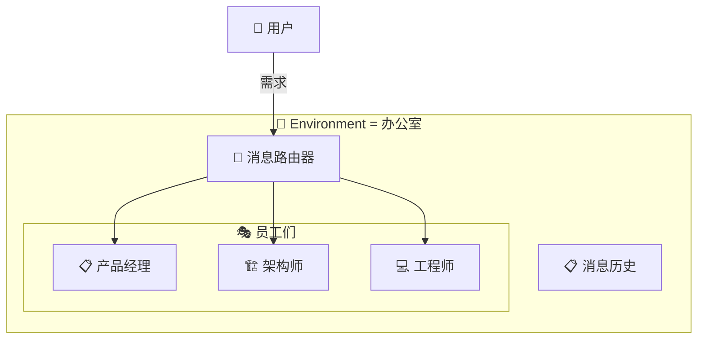
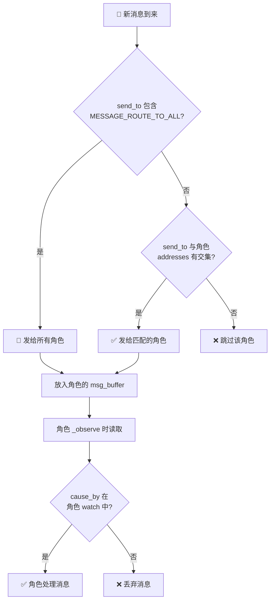
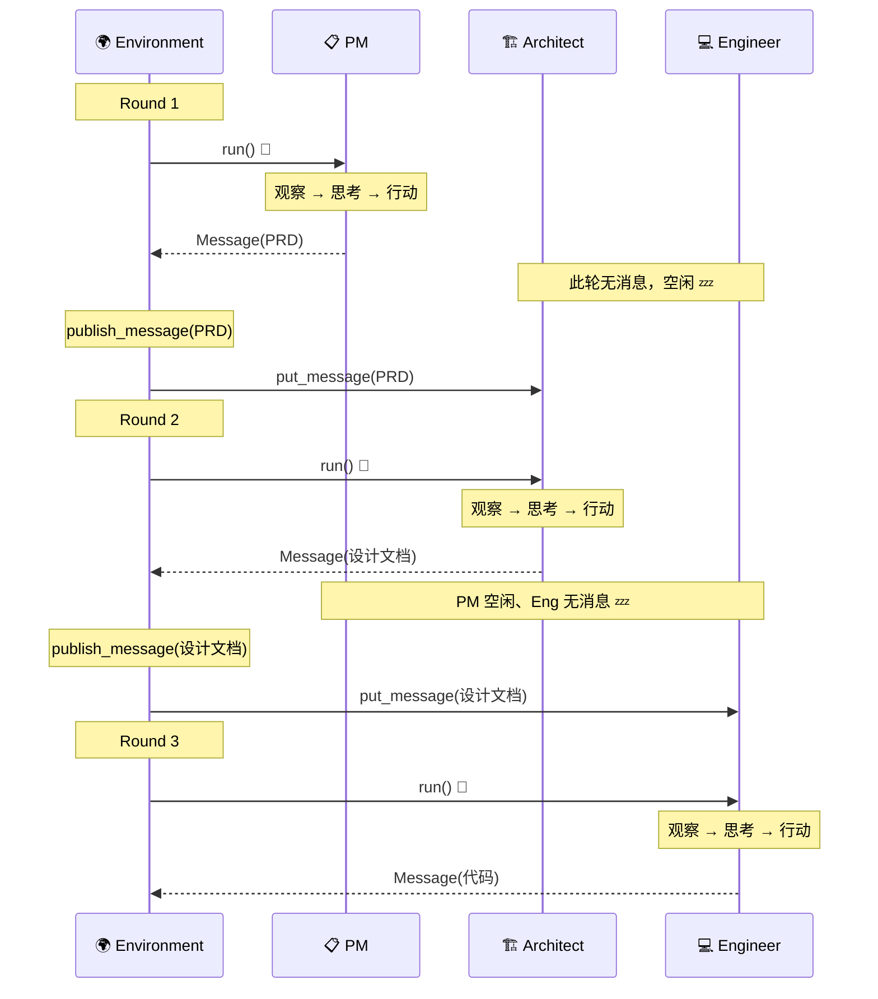
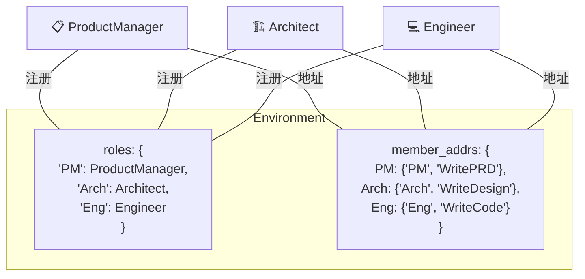
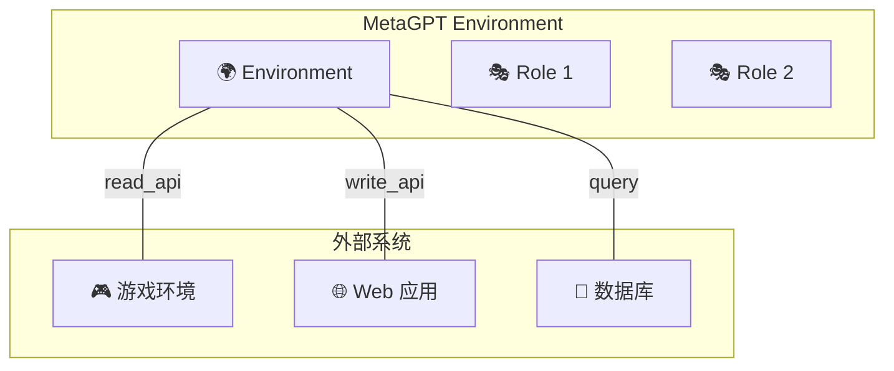

# 🌍 第五章：Environment 环境与通信

> 🎯 本章目标：理解 Environment 的作用、消息路由机制和角色并发执行原理。

---

## 5.1 💡 什么是 Environment？

**Environment（环境）** 是 MetaGPT 中所有角色共同工作的「空间」。

### 通俗比喻 🏢

如果角色（Role）是公司员工，那 Environment 就是**办公室**：

- 🏢 **提供工作场所** — 所有员工在这里工作
- 📮 **充当邮件室** — 负责分发消息给对应的人
- 📋 **记录工作日志** — 保存所有的消息历史
- ⏰ **统一调度** — 安排谁先工作、谁后工作



---

## 5.2 📐 Environment 的结构

```python
class Environment(ExtEnv):
    """角色运行的环境"""
    
    desc: str = ""                      # 环境描述
    roles: dict[str, BaseRole] = {}     # 所有角色 {name: role}
    member_addrs: Dict[Role, Set] = {}  # 地址映射 {role: {地址集合}}
    history: Memory                     # 消息历史记录
    context: Context                    # 共享上下文
```

### 核心职责

| 职责 | 方法 | 说明 |
|------|------|------|
| 管理角色 | `add_roles()` | 添加角色到环境中 |
| 消息路由 | `publish_message()` | 将消息分发给对应角色 |
| 执行调度 | `run()` | 调度所有角色并发执行 |
| 地址管理 | `set_addresses()` | 设置角色的消息地址 |

---

## 5.3 📮 消息路由详解

消息路由是 Environment 最核心的功能。它决定了「谁能收到什么消息」。

### 路由算法

```python
def publish_message(self, message: Message, peekable: bool = True):
    """发布消息到环境中"""
    
    # 1. 记录到历史
    self.history.add(message)
    
    # 2. 遍历所有角色，检查是否匹配
    for role, addrs in self.member_addrs.items():
        # 判断这条消息是否应该发给这个角色
        if is_send_to(message, addrs):
            role.put_message(message)
```

### `is_send_to` 匹配规则

```python
def is_send_to(message: Message, addresses: set) -> bool:
    """判断消息是否应该发送给某个角色"""
    
    # 规则1：消息发给所有人
    if MESSAGE_ROUTE_TO_ALL in message.send_to:
        return True
    
    # 规则2：消息的 send_to 与角色的地址有交集
    if message.send_to & addresses:
        return True
    
    return False
```

### 地址系统

每个角色都有一组**地址**，类似于邮箱地址：

```python
# 角色的地址通常包含：
addresses = {
    "Architect",              # 角色的 profile 名称
    "Alice",                  # 角色的 name
    "WriteDesign",            # 角色的 Action 类名
    "{某个自定义地址}",         # 自定义地址
}
```

### 完整路由流程



> 💡 **两层过滤**：
> 1. **第一层（Environment）** — 基于 `send_to` 和 `addresses` 的路由
> 2. **第二层（Role）** — 基于 `cause_by` 和 `watch` 的过滤
> 
> 为什么两层？这就像现实中邮件系统的设计：邮局先把信送到你的信箱（第一层），你打开信箱后选择性阅读（第二层）。

---

## 5.4 🔄 环境的执行循环

```python
async def run(self, k=1):
    """运行环境中的所有角色"""
    for _ in range(k):
        futures = []
        for role in self.roles.values():
            if not role.is_idle:  # 只运行有工作的角色
                futures.append(role.run())
        
        # ⚡ 并发执行所有角色！
        await asyncio.gather(*futures)
```

### 并发执行图解



> 🤔 **为什么用并发？** 在实际场景中，可能有多个角色同时有工作需要处理。比如一个角色在写代码，另一个角色在审查之前的代码。并发执行可以提高效率。

---

## 5.5 👥 角色管理

### 添加角色

```python
def add_roles(self, roles: Iterable[Role]):
    """向环境中添加角色"""
    for role in roles:
        # 1. 设置角色所在的环境
        role.set_env(self)
        
        # 2. 注册角色
        self.roles[role.profile] = role
        
        # 3. 配置地址映射
        self.member_addrs[role] = role.addresses
```

### 角色与环境的关系



---

## 5.6 🏢 Environment 的扩展

MetaGPT 的 Environment 支持扩展，可以对接外部系统：

### ExtEnv 可扩展环境

```python
class ExtEnv(BaseModel):
    """可扩展环境基类"""
    
    @mark_as_readable
    def get_game_state(self):
        """标记为可读接口"""
        ...
    
    @mark_as_writeable
    def perform_action(self, action):
        """标记为可写接口"""
        ...
```

### 扩展场景举例



> 💡 **设计原理**：通过 `@mark_as_readable` 和 `@mark_as_writeable` 装饰器，Environment 可以暴露外部系统的接口给角色使用。这使得 MetaGPT 不仅限于文本对话，还可以操作游戏、网页、数据库等外部系统。

---

## 5.7 💻 实战：自定义 Environment

```python
"""custom_env_demo.py - 自定义环境示例"""
import asyncio
from metagpt.environment import Environment
from metagpt.team import Team
from metagpt.roles import Role
from metagpt.actions import Action
from metagpt.schema import Message

# 自定义动作
class AskQuestion(Action):
    name: str = "AskQuestion"
    
    async def run(self, topic: str) -> str:
        return await self._aask(f"请关于'{topic}'提出一个深度问题")

class AnswerQuestion(Action):
    name: str = "AnswerQuestion"
    
    async def run(self, question: str) -> str:
        return await self._aask(f"请详细回答这个问题：{question}")

# 提问者
class Questioner(Role):
    name: str = "小问"
    profile: str = "Questioner"
    
    def __init__(self, **kwargs):
        super().__init__(**kwargs)
        self.set_actions([AskQuestion])
        self._watch([AnswerQuestion])  # 看到回答后继续提问

# 回答者
class Answerer(Role):
    name: str = "小答"
    profile: str = "Answerer"
    
    def __init__(self, **kwargs):
        super().__init__(**kwargs)
        self.set_actions([AnswerQuestion])
        self._watch([AskQuestion])  # 看到问题就回答

# 创建自定义环境并运行
async def main():
    env = Environment(desc="一个知识问答的环境")
    team = Team(env=env)
    team.hire([Questioner(), Answerer()])
    team.run_project("人工智能的未来发展")
    await team.run(n_round=4)

asyncio.run(main())
```

---

## 5.8 📝 本章小结

| 概念 | 说明 |
|------|------|
| **Environment** | 角色运行的共享空间，负责消息路由和执行调度 |
| **消息路由** | 基于 send_to + addresses 的两层过滤机制 |
| **并发执行** | 使用 asyncio.gather 并发运行所有活跃角色 |
| **地址系统** | 每个角色有一组地址，用于消息路由匹配 |
| **ExtEnv** | 可扩展环境，对接游戏、Web 等外部系统 |

### 设计亮点 ✨

1. **发布-订阅模式** — 角色不直接通信，通过 Environment 中转，降低耦合
2. **两层过滤** — Environment 路由 + Role 订阅，精确控制消息流向
3. **并发执行** — 充分利用异步编程，提高多角色执行效率
4. **可扩展** — 通过 ExtEnv 机制，轻松对接外部系统

## ➡️ 下一章

有了 Environment，多个角色就可以在一起工作了。但谁来组建和管理这个团队？答案是 **Team**。让我们进入 [第六章：Team 团队协作](./06-team-system.md)！
