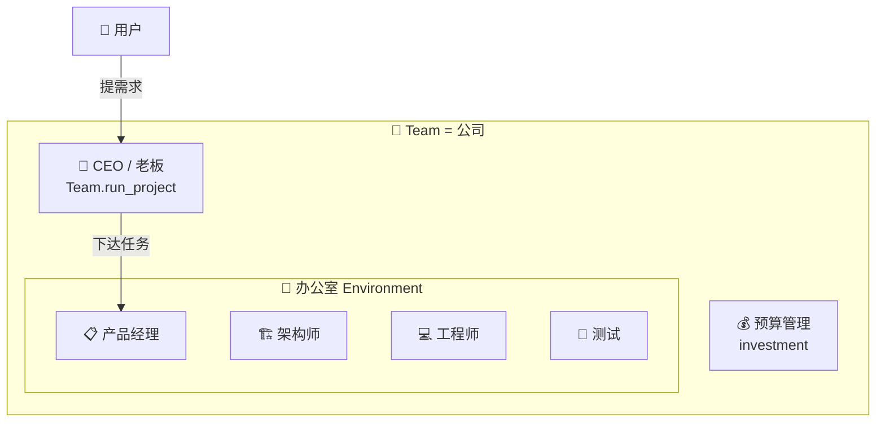
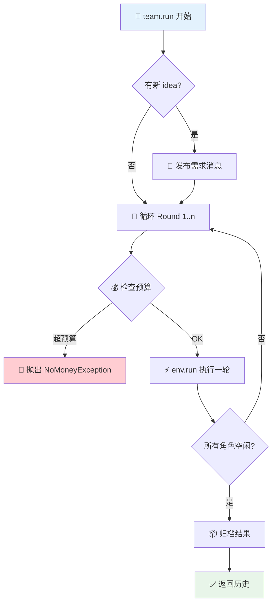
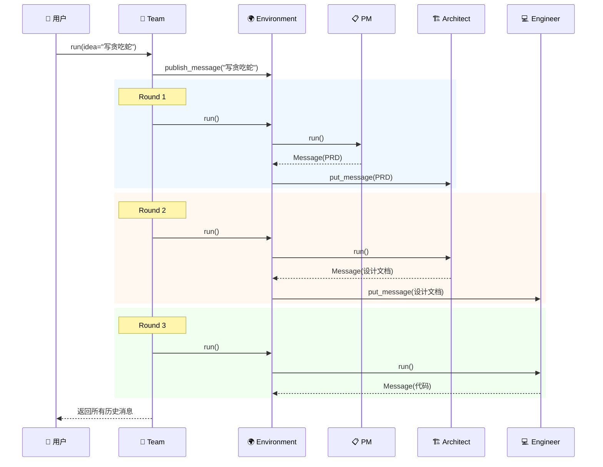
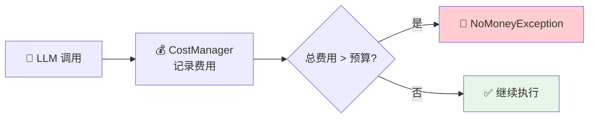
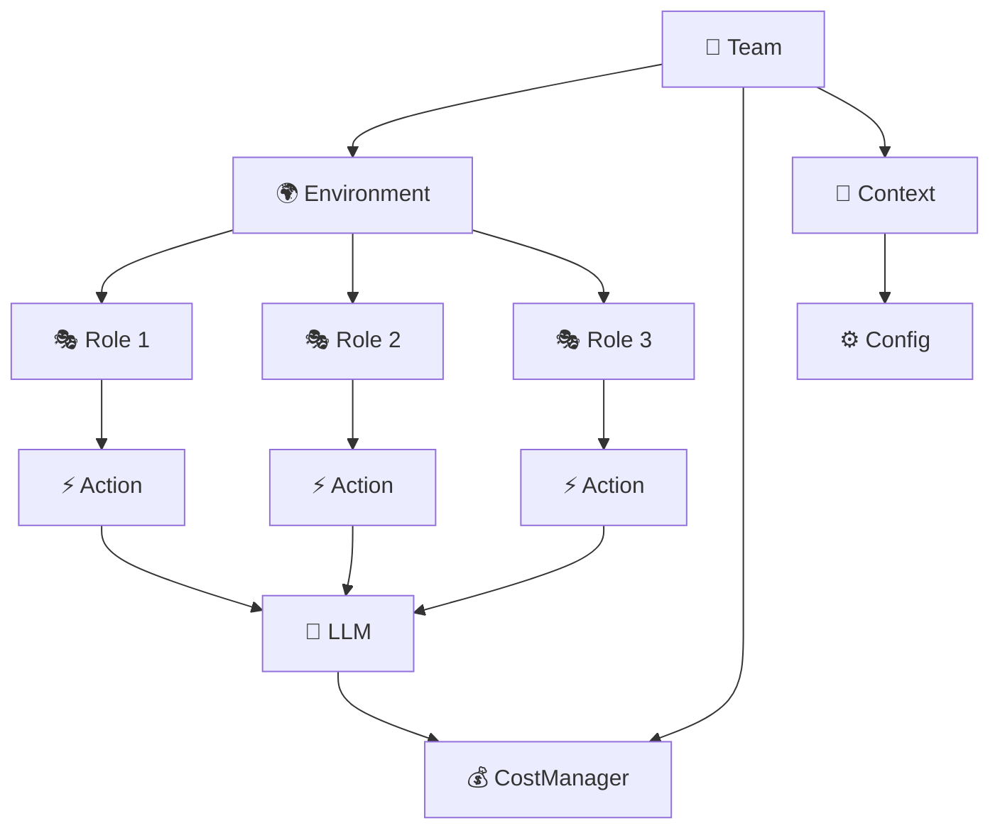

# 👥 第六章：Team 团队协作

> 🎯 本章目标：理解 Team 如何组建、管理和运行一个多智能体团队。

---

## 6.1 💡 什么是 Team？

**Team（团队）** 是 MetaGPT 中最高层的抽象——它代表一个完整的**协作团队**。

### 通俗比喻 🏢

如果说：
- **Action** = 员工的一项技能
- **Role** = 一个员工
- **Environment** = 办公室

那么 **Team** = **整个公司**



Team 是用户与 MetaGPT 框架交互的**入口**，它负责：
1. **招聘** — 组建团队（`hire`）
2. **预算** — 管理经费（`invest`）
3. **派活** — 发布项目需求（`run_project`）
4. **监督** — 运行执行循环（`run`）

---

## 6.2 📐 Team 的结构

Team 定义在 `metagpt/team.py`，约 140 行，非常简洁：

```python
class Team(BaseModel):
    """多智能体团队"""
    
    env: Optional[Environment] = None  # 工作环境
    investment: float = 10.0           # 💰 预算（美元）
    idea: str = ""                     # 💡 项目需求
    use_mgx: bool = True               # 是否使用 MGX 环境
```

### 核心方法

| 方法 | 作用 | 类比 |
|------|------|------|
| `hire(roles)` | 添加角色到团队 | 招聘员工 |
| `invest(amount)` | 设置预算上限 | 公司拨款 |
| `run_project(idea)` | 发布项目需求 | 老板提需求 |
| `run(n_round)` | 执行工作循环 | 让公司运转起来 |

---

## 6.3 🏗️ 团队组建流程

### 1️⃣ 创建团队

```python
from metagpt.team import Team
from metagpt.roles import ProductManager, Architect, Engineer

# 创建团队
team = Team()
```

### 2️⃣ 招聘员工

```python
# 添加角色
team.hire([
    ProductManager(),  # 📋 产品经理
    Architect(),       # 🏗️ 架构师
    Engineer(),        # 💻 工程师
])
```

**`hire` 方法内部做了什么？**

```python
def hire(self, roles: list[Role]):
    """招聘：将角色添加到环境中"""
    self.env.add_roles(roles)
    # add_roles 会：
    # 1. 设置角色的环境引用
    # 2. 注册角色到 roles 字典
    # 3. 配置消息地址映射
```

### 3️⃣ 设置预算

```python
# 设置预算（单位：美元）
team.invest(investment=3.0)
```

> 💡 **为什么要设置预算？** 每次调用 LLM API 都要花钱。如果智能体陷入无限循环，可能会产生大量费用。预算机制是一个**安全阀**，防止成本失控。

### 4️⃣ 发布需求

```python
# 向团队发布项目需求
team.run_project(idea="开发一个贪吃蛇游戏")
```

**`run_project` 的内部逻辑：**

```python
def run_project(self, idea: str, send_to: str = ""):
    """发布需求到环境中"""
    self.idea = idea
    
    # 创建一条消息
    message = Message(
        role="Human",
        content=idea,
        cause_by=UserRequirement,  # 标记为用户需求
        send_to=send_to or MESSAGE_ROUTE_TO_ALL
    )
    
    # 发布到环境
    self.env.publish_message(message)
```

### 5️⃣ 开始运行

```python
# 运行 3 轮
await team.run(n_round=3)
```

---

## 6.4 🔄 团队执行循环

`team.run()` 是团队运行的核心方法：

```python
async def run(self, n_round=3, idea="", send_to="", auto_archive=True):
    """团队主循环"""
    
    # 1. 发布初始需求
    if idea:
        self.run_project(idea=idea, send_to=send_to)
    
    # 2. 执行 n_round 轮
    for round_num in range(n_round):
        # 2a. 检查预算
        self._check_balance()  # 超预算则抛出异常
        
        # 2b. 运行一轮（所有角色并发执行）
        await self.env.run()
        
        # 2c. 检查是否所有角色都空闲
        if self.env.is_idle:
            break  # 所有人都做完了
    
    # 3. 归档结果
    if auto_archive:
        self.env.archive()
    
    return self.env.history
```

### 执行流程图



### 一个完整执行过程



---

## 6.5 💰 预算管理

### 预算检查机制

```python
def _check_balance(self):
    """检查是否超预算"""
    if self.context.cost_manager.total_cost > self.investment:
        raise NoMoneyException(
            self.context.cost_manager.total_cost,
            f"预算不足！已花费 ${self.context.cost_manager.total_cost}，"
            f"超出预算 ${self.investment}"
        )
```

### CostManager 费用管理

```python
class CostManager:
    """追踪 LLM API 调用费用"""
    
    total_cost: float = 0.0           # 总费用
    total_prompt_tokens: int = 0      # 总输入 token
    total_completion_tokens: int = 0  # 总输出 token
    
    def update_cost(self, prompt_tokens, completion_tokens, model):
        """每次 LLM 调用后更新费用"""
        cost = self._calculate_cost(prompt_tokens, completion_tokens, model)
        self.total_cost += cost
```

### 费用管理流程



> 💡 **实际建议**：开发调试时建议设置较小的预算（如 `team.invest(1.0)`），避免意外的高额 API 费用。正式运行时再根据需求调整。

---

## 6.6 💾 团队状态持久化

Team 支持**序列化/反序列化**，可以保存和恢复团队状态：

```python
# 保存团队状态
team.serialize(stg_path=Path("./my_project"))
# 会生成 my_project/team.json

# 恢复团队状态
restored_team = Team.deserialize(stg_path=Path("./my_project"))
await restored_team.run(n_round=2)  # 继续执行
```

**为什么需要持久化？**

1. **长时间运行** — 大项目可能运行数小时，需要断点续传
2. **调试** — 保存中间状态便于排查问题
3. **增量开发** — 在之前的基础上继续添加需求

---

## 6.7 💻 完整示例：模拟软件公司

```python
"""software_company.py - 完整的软件公司模拟"""
import asyncio
from metagpt.team import Team
from metagpt.roles import (
    ProductManager,
    Architect, 
    ProjectManager,
    Engineer
)

async def main():
    # 1️⃣ 创建团队
    team = Team()
    
    # 2️⃣ 招聘团队成员
    team.hire([
        ProductManager(),    # 📋 产品经理：分析需求
        Architect(),         # 🏗️ 架构师：设计系统
        ProjectManager(),    # 📊 项目经理：拆分任务
        Engineer(),          # 💻 工程师：编写代码
    ])
    
    # 3️⃣ 设置预算
    team.invest(investment=5.0)  # 5 美元预算
    
    # 4️⃣ 发布需求并运行
    await team.run(
        idea="开发一个命令行待办事项管理工具，支持添加、删除、列表、标记完成",
        n_round=5  # 最多运行 5 轮
    )

asyncio.run(main())
```

### 预期执行过程

```
Round 1: ProductManager 分析需求 → 输出 PRD 文档
Round 2: Architect 设计架构 → 输出系统设计文档
Round 3: ProjectManager 拆分任务 → 输出任务列表
Round 4: Engineer 编写代码 → 输出完整代码
Round 5: (如果有后续工作继续执行)
```

---

## 6.8 📝 本章小结

| 概念 | 说明 |
|------|------|
| **Team** | 最高层抽象，管理团队的组建和运行 |
| **hire** | 向团队添加角色 |
| **invest** | 设置预算上限，防止费用失控 |
| **run_project** | 发布项目需求 |
| **run** | 执行主循环：检查预算 → 运行角色 → 检查空闲 |
| **序列化** | 保存/恢复团队状态，支持断点续传 |

### Team 与其他组件的关系



### 设计亮点 ✨

1. **简洁的 API** — 只需 `hire` → `invest` → `run`，三步搞定
2. **预算管控** — 内置费用追踪，避免意外高额支出
3. **状态持久化** — 支持断点续传，适合长时间运行
4. **灵活组合** — 自由选择需要的角色组合

## ➡️ 下一章

团队运转需要 LLM 的支持。MetaGPT 支持多种 LLM 提供商，让我们进入 [第七章：LLM Provider 大模型接入](./07-llm-provider.md)！
