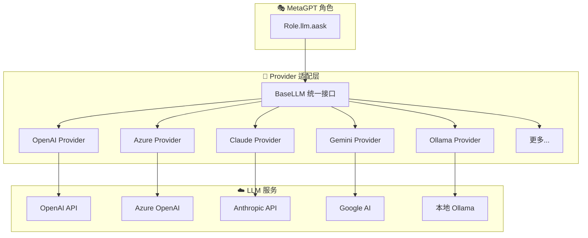
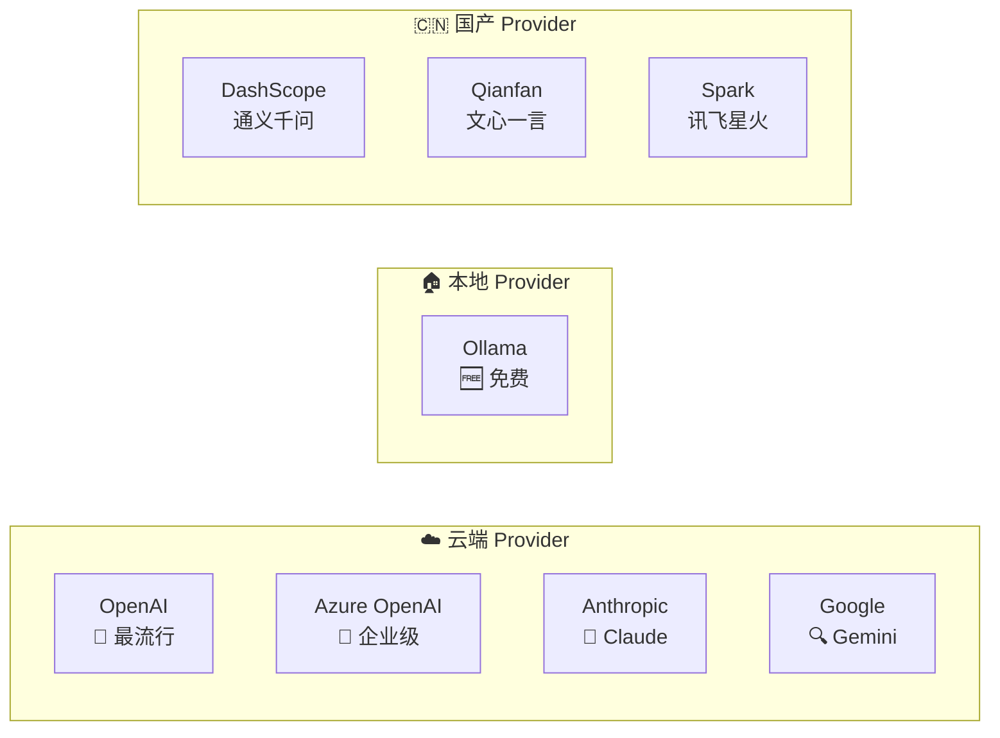
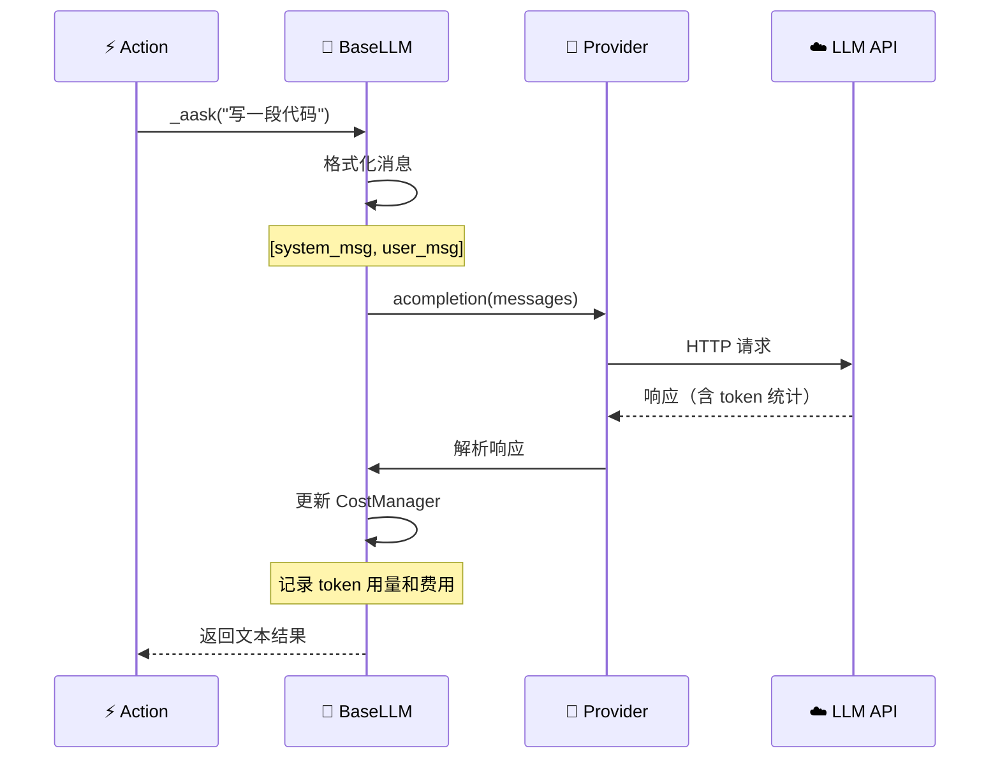

# 🤖 第七章：LLM Provider 大模型接入

> 🎯 本章目标：了解 MetaGPT 的 LLM 提供商架构，掌握多种模型的配置方法。

---

## 7.1 💡 Provider 架构概述

MetaGPT 支持接入多种大语言模型（LLM），通过**Provider 模式**统一管理。

### 通俗比喻 🔌

Provider 就像**电源适配器**：不同国家的插座标准不同（美标、欧标、英标），但通过适配器，你的设备都能正常充电。

MetaGPT 的 Provider 也是如此：不同的 LLM 厂商有不同的 API 格式，但 Provider 将它们适配成**统一的接口**。



---

## 7.2 📐 BaseLLM 基类

所有 Provider 都继承自 `BaseLLM`：

```python
class BaseLLM(ABC):
    """LLM 抽象基类——所有 Provider 的「标准接口」"""
    
    config: LLMConfig                           # 配置
    cost_manager: Optional[CostManager] = None  # 费用追踪
    system_prompt: str = "You are a helpful assistant."
    
    # 核心方法
    async def aask(self, msg, system_msgs=None) -> str:
        """提问（最常用的方法）"""
    
    async def acompletion(self, messages) -> dict:
        """完成（原始 API 调用）"""
    
    async def acompletion_text(self, messages) -> str:
        """完成并只返回文本"""
    
    # 消息格式化
    def _user_msg(self, msg, images=None) -> dict:
        """格式化用户消息"""
    
    def _system_msg(self, msg) -> dict:
        """格式化系统消息"""
    
    def _assistant_msg(self, msg) -> dict:
        """格式化助手消息"""
```

### 关键方法说明

| 方法 | 作用 | 使用场景 |
|------|------|---------|
| `aask(msg)` | 向 LLM 提问并获取回答 | 最常用，Action 中的 `_aask` 就是调它 |
| `acompletion(messages)` | 原始 API 调用 | 需要完整控制对话的场景 |
| `acompletion_text(messages)` | 完成并返回纯文本 | 只需要文本结果的场景 |

---

## 7.3 🔧 配置方法

### LLMConfig 配置结构

```python
class LLMConfig(BaseModel):
    """LLM 配置"""
    
    api_type: str = "openai"           # Provider 类型
    model: str = "gpt-4-turbo"         # 模型名称
    base_url: str = ""                 # API 地址
    api_key: str = ""                  # API 密钥
    
    # 可选参数
    temperature: float = 0.0           # 随机性（0=确定性，1=创造性）
    max_token: int = 4096              # 最大输出 token
    top_p: float = 1.0                 # 核采样参数
    timeout: int = 600                 # 超时时间（秒）
    proxy: str = ""                    # 代理地址
```

### 配置文件示例

配置文件位于 `~/.metagpt/config2.yaml`：

```yaml
# ======== 基础配置 ========
llm:
  api_type: "openai"
  model: "gpt-4-turbo"
  base_url: "https://api.openai.com/v1"
  api_key: "sk-xxx"
  temperature: 0.0
```

---

## 7.4 🌐 支持的 Provider

### 1️⃣ OpenAI

```yaml
llm:
  api_type: "openai"
  model: "gpt-4-turbo"      # 或 gpt-3.5-turbo, gpt-4o 等
  base_url: "https://api.openai.com/v1"
  api_key: "sk-your-key"
```

### 2️⃣ Azure OpenAI

```yaml
llm:
  api_type: "azure"
  model: "gpt-4"            # 部署名称
  base_url: "https://your-resource.openai.azure.com/"
  api_key: "your-azure-key"
  api_version: "2024-02-01"
```

### 3️⃣ Anthropic Claude

```yaml
llm:
  api_type: "claude"
  model: "claude-3-opus-20240229"
  base_url: "https://api.anthropic.com"
  api_key: "sk-ant-xxx"
```

### 4️⃣ Google Gemini

```yaml
llm:
  api_type: "gemini"
  model: "gemini-pro"
  api_key: "your-google-key"
```

### 5️⃣ Ollama（本地模型）

```yaml
llm:
  api_type: "ollama"
  model: "llama2"            # 或其他 Ollama 支持的模型
  base_url: "http://localhost:11434/api"
  api_key: "ollama"          # Ollama 不需要真实 key
```

### 6️⃣ 其他支持的 Provider

| Provider | api_type | 说明 |
|----------|----------|------|
| AWS Bedrock | `bedrock` | AWS 托管的模型服务 |
| 阿里云 DashScope | `dashscope` | 通义千问等 |
| 百度千帆 | `qianfan` | 文心一言 |
| 讯飞星火 | `spark` | 讯飞大模型 |
| 智谱 AI | `zhipuai` | GLM 系列 |

### Provider 对比图



---

## 7.5 🎯 多模型配置

MetaGPT 支持为不同的角色使用不同的模型，实现**成本与质量的平衡**。

### 为什么需要多模型？

| 角色 | 任务复杂度 | 推荐模型 | 原因 |
|------|-----------|---------|------|
| 产品经理 | 高 | GPT-4 | 需求分析需要深度理解 |
| 架构师 | 高 | GPT-4 | 系统设计需要丰富经验 |
| 工程师 | 中 | GPT-4 / GPT-3.5 | 代码生成，GPT-3.5 也能胜任 |
| 测试工程师 | 中低 | GPT-3.5 | 写测试相对简单 |

### 配置方式

```yaml
# config2.yaml - 多模型配置
llm:
  api_type: "openai"
  model: "gpt-4-turbo"         # 默认模型
  base_url: "https://api.openai.com/v1"
  api_key: "sk-xxx"

# 额外的模型配置
models:
  - api_type: "openai"
    model: "gpt-3.5-turbo"    # 便宜模型
    base_url: "https://api.openai.com/v1"
    api_key: "sk-xxx"
```

### 代码中指定模型

```python
# 为特定 Action 指定模型
class WriteTest(Action):
    llm_name_or_type: str = "gpt-3.5-turbo"  # 用便宜模型写测试
    
    async def run(self, code: str):
        return await self._aask(f"为以下代码写单元测试：\n{code}")
```

> 💡 **成本优化策略**：核心决策用强模型（如 GPT-4），执行性任务用弱模型（如 GPT-3.5）。这样既保证质量又控制成本。就像公司里，重大决策由高管做，日常执行由普通员工完成。

---

## 7.6 🔄 Provider 的工作流程



---

## 7.7 👁️ 多模态支持

部分 Provider 支持**多模态输入**（文本 + 图片）：

```python
# 检查模型是否支持图片输入
if llm.support_image_input:
    # 发送带图片的请求
    response = await llm.aask(
        msg="描述这张图片的内容",
        images=["https://example.com/image.jpg"]
    )
```

### 图片输入的处理

```python
def _user_msg_with_imgs(self, msg: str, images: list):
    """构建带图片的用户消息"""
    content = [{"type": "text", "text": msg}]
    
    for image in images:
        if image.startswith("http"):
            # URL 方式
            content.append({
                "type": "image_url",
                "image_url": {"url": image}
            })
        else:
            # Base64 方式
            content.append({
                "type": "image_url",
                "image_url": {"url": f"data:image/png;base64,{image}"}
            })
    
    return {"role": "user", "content": content}
```

---

## 7.8 📝 本章小结

| 概念 | 说明 |
|------|------|
| **BaseLLM** | LLM 的统一抽象接口 |
| **Provider** | 具体 LLM 服务的适配器 |
| **LLMConfig** | LLM 连接和参数配置 |
| **aask()** | 向 LLM 提问的核心方法 |
| **多模型** | 为不同角色配置不同模型 |
| **CostManager** | 追踪 API 调用费用 |

### 设计亮点 ✨

1. **统一接口** — 所有 Provider 实现相同的 BaseLLM 接口，切换模型零成本
2. **多模型支持** — 不同角色可以用不同模型，平衡成本与质量
3. **费用追踪** — 自动记录每次 API 调用的 token 数和费用
4. **多模态** — 支持文本、图片等多种输入格式
5. **广泛兼容** — 支持 10+ 种 LLM 服务商

## ➡️ 下一章

LLM 让智能体能「思考」，但如何「记住」之前的信息？让我们进入 [第八章：Memory 记忆系统](./08-memory-system.md)！
