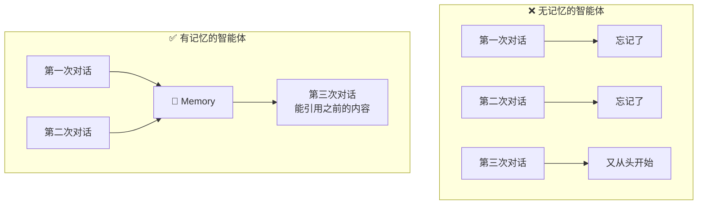
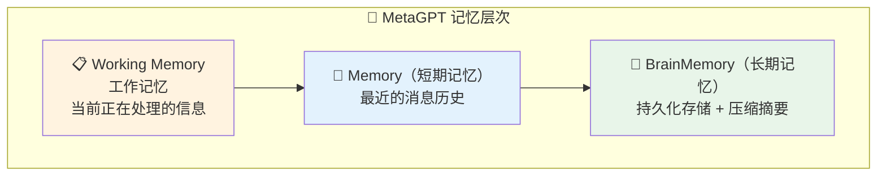
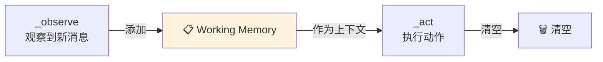
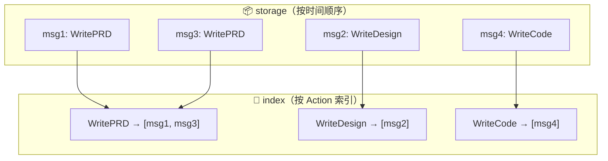
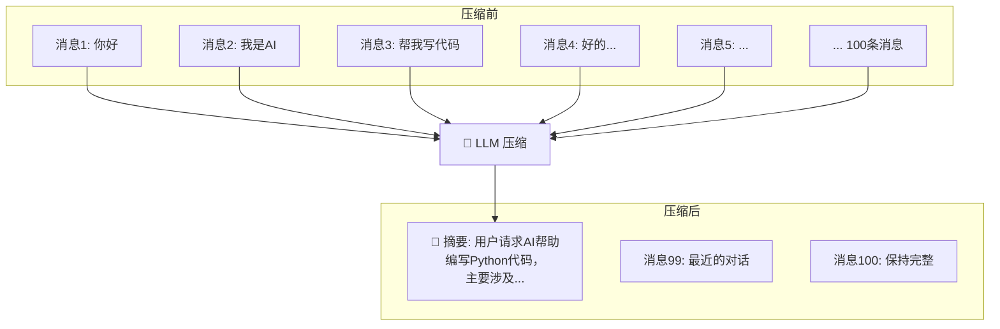
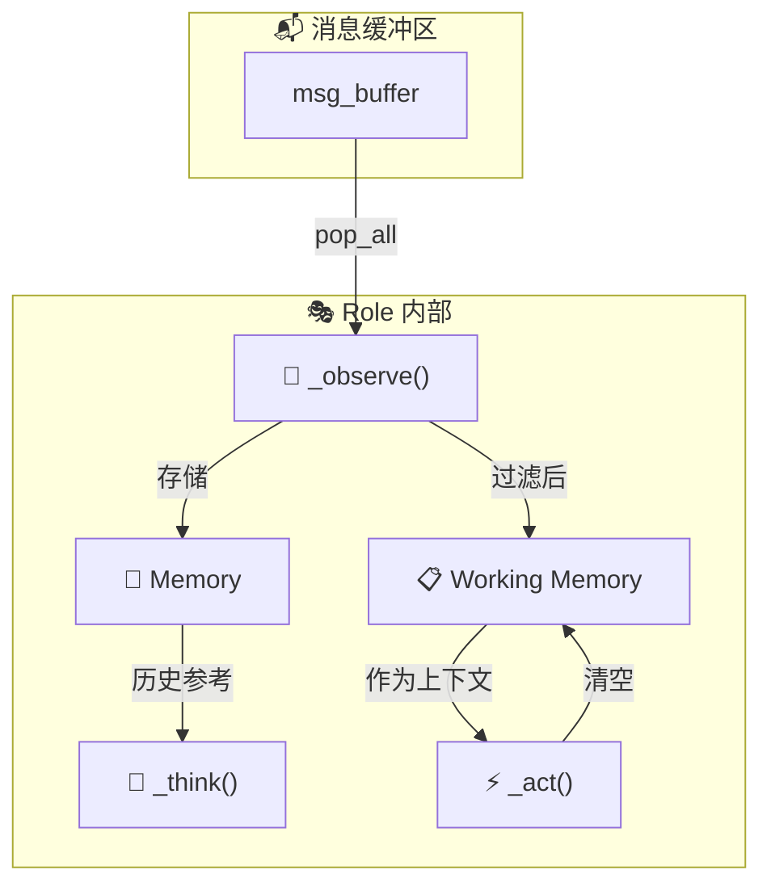
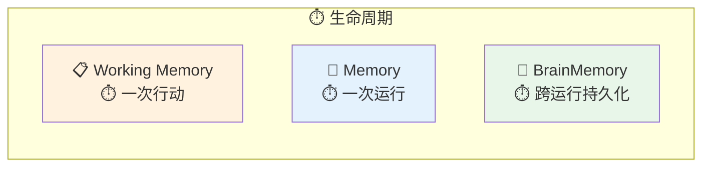

# 🧠 第八章：Memory 记忆系统

> 🎯 本章目标：理解 MetaGPT 的记忆架构，掌握短期记忆、工作记忆和长期记忆的使用方法。

---

## 8.1 💡 为什么需要记忆？

在多智能体协作中，记忆至关重要：

### 通俗比喻 🧠

想象一个新员工加入公司：

- **没有记忆** ❌：每次开会都忘了上次讨论的内容，反复问同样的问题
- **有记忆** ✅：记得之前的讨论，能在此基础上推进工作

对于 AI 智能体也是一样——LLM 本身是「无状态」的，每次调用都是独立的。**记忆系统让智能体能够「记住」之前的工作成果和对话历史**。



---

## 8.2 📐 记忆的层次结构

MetaGPT 的记忆系统分为三层，类似于人类的记忆结构：



### 类比人类记忆

| MetaGPT 记忆 | 人类类比 | 特点 |
|-------------|---------|------|
| **Working Memory** | 工作台上的便签 | 当前任务的即时信息，用完就清 |
| **Memory** | 大脑短期记忆 | 最近的对话和事件，有容量限制 |
| **BrainMemory** | 笔记本/日记 | 长期保存，支持压缩和检索 |

---

## 8.3 📋 Working Memory（工作记忆）

工作记忆存放**当前正在处理的消息**，是角色行动的「即时上下文」。

```python
# 在 RoleContext 中
class RoleContext(BaseModel):
    working_memory: Memory = Field(default_factory=Memory)
```

### 工作记忆的生命周期



```python
# 在 _observe 中：将新消息加入工作记忆
for msg in news:
    self.rc.working_memory.add(msg)

# 在 _act 中：使用工作记忆作为上下文
context = self.rc.working_memory.get()
response = await todo.run(context)

# 动作执行后：清空工作记忆
self.rc.working_memory.clear()
```

> 💡 **为什么要清空？** 工作记忆是「一次性」的——当前任务完成后就没用了。就像你做完当前文件的编辑，就可以关掉便签了。这样避免了旧信息干扰新任务。

---

## 8.4 💾 Memory（短期记忆）

Memory 是角色的**主记忆**，存储所有接收到的消息历史。

```python
class Memory(BaseModel):
    """消息存储器"""
    
    storage: list[Message] = []                    # 所有消息
    index: DefaultDict[str, list[Message]] = {}    # 按 cause_by 索引
    ignore_id: bool = False                        # 是否忽略 ID 去重
```

### 核心方法

```python
class Memory:
    def add(self, message: Message):
        """添加一条消息"""
        if not self.ignore_id and message.id in self._seen_ids:
            return  # 去重
        self.storage.append(message)
        self.index[message.cause_by].append(message)
    
    def get(self, k=0) -> list[Message]:
        """获取最近 k 条消息（k=0 返回全部）"""
        return self.storage[-k:] if k else self.storage
    
    def get_by_role(self, role: str) -> list[Message]:
        """按发送者角色获取消息"""
        return [m for m in self.storage if m.role == role]
    
    def get_by_actions(self, actions: set) -> list[Message]:
        """按 Action 类型获取消息"""
        result = []
        for action in actions:
            action_str = any_to_str(action)
            result.extend(self.index.get(action_str, []))
        return result
    
    def find_news(self, observed: list, k=0) -> list[Message]:
        """找出未看过的新消息"""
        seen_ids = {msg.id for msg in observed}
        news = [m for m in self.storage if m.id not in seen_ids]
        return news[-k:] if k else news
    
    def try_remember(self, keyword: str) -> list[Message]:
        """按关键词搜索记忆"""
        return [m for m in self.storage if keyword in m.content]
    
    def delete_newest(self):
        """删除最新的一条消息"""
        if self.storage:
            self.storage.pop()
    
    def clear(self):
        """清空所有记忆"""
        self.storage.clear()
        self.index.clear()
```

### 记忆的索引结构



> 💡 **设计原理**：为什么同时维护 `storage` 和 `index`？`storage` 保持时间顺序，用于获取「最近的消息」；`index` 按 Action 分类，用于快速检索「某种类型的消息」。空间换时间，查询效率更高。

---

## 8.5 📀 BrainMemory（长期记忆）

BrainMemory 提供了**持久化存储**和**压缩摘要**能力：

```python
class BrainMemory(BaseModel):
    """长期记忆——支持压缩和持久化"""
    
    history: List[Message] = []      # 对话历史
    knowledge: List[Message] = []    # 知识库
    historical_summary: str = ""     # 压缩后的历史摘要
    llm: Optional[BaseLLM] = None    # 用于压缩的 LLM
```

### 核心功能

```python
class BrainMemory:
    def add_talk(self, msg: Message):
        """添加用户消息"""
        self.history.append(msg)
    
    def add_answer(self, msg: Message):
        """添加 AI 回复"""
        self.history.append(msg)
    
    async def summarize(self):
        """压缩历史记忆"""
        # 当历史过长时，用 LLM 将旧历史压缩为摘要
        if len(self.history) > MAX_HISTORY:
            old_history = self.history[:COMPRESS_COUNT]
            summary = await self.llm.aask(
                f"请总结以下对话的要点：\n{old_history}"
            )
            self.historical_summary = summary
            self.history = self.history[COMPRESS_COUNT:]
    
    async def dumps(self, redis_key: str, timeout_sec=1800):
        """持久化到 Redis"""
        # 将记忆序列化保存到 Redis
    
    async def loads(self, redis_key: str):
        """从 Redis 加载"""
        # 反序列化恢复记忆
```

### 长期记忆的压缩机制



> 💡 **设计原理**：LLM 的上下文窗口有限（如 4K、8K、128K tokens）。当历史消息太多时，不可能全部塞进 prompt。压缩机制用 LLM 总结旧历史为简短摘要，既保留了关键信息，又控制了 token 数量。类似于人类大脑的记忆整合过程——细节逐渐模糊，但核心要点保留。

---

## 8.6 🔄 记忆在角色中的应用

### 记忆流转全景图



### 记忆的使用时机

| 阶段 | 使用的记忆 | 目的 |
|------|-----------|------|
| `_observe()` | Memory | 去重：检查消息是否已处理过 |
| `_think()` | Memory | 决策：根据历史决定下一步 |
| `_act()` | Working Memory | 执行：当前任务的上下文 |

---

## 8.7 💻 实战：自定义记忆使用

```python
"""memory_demo.py - 记忆系统使用演示"""
from metagpt.roles import Role
from metagpt.actions import Action
from metagpt.schema import Message

class SmartAssistant(Role):
    """一个有记忆的智能助手"""
    name: str = "小忆"
    profile: str = "SmartAssistant"
    
    def __init__(self, **kwargs):
        super().__init__(**kwargs)
        self.set_actions([RespondWithMemory])
    
    async def _act(self) -> Message:
        """自定义行动：利用记忆增强回答"""
        todo = self.rc.todo
        
        # 获取所有历史消息作为上下文
        history = self.rc.memory.get()
        history_text = "\n".join([
            f"[{m.role}]: {m.content}" for m in history[-10:]  # 最近10条
        ])
        
        # 获取当前工作记忆
        current = self.rc.working_memory.get()
        current_text = current[-1].content if current else ""
        
        # 组装带历史的 prompt
        response = await todo.run(
            current_question=current_text,
            history=history_text
        )
        
        msg = Message(content=response, role="assistant")
        self.rc.working_memory.clear()
        return msg

class RespondWithMemory(Action):
    name: str = "RespondWithMemory"
    
    async def run(self, current_question: str, history: str) -> str:
        prompt = f"""基于以下对话历史回答当前问题。
        
## 对话历史
{history}

## 当前问题
{current_question}

## 要求
- 回答要结合之前的对话上下文
- 如果之前讨论过相关内容，请引用

## 回答
"""
        return await self._aask(prompt)
```

---

## 8.8 📝 本章小结

| 概念 | 说明 |
|------|------|
| **Working Memory** | 工作记忆，当前任务的即时上下文 |
| **Memory** | 短期记忆，所有接收消息的历史 |
| **BrainMemory** | 长期记忆，支持压缩和持久化 |
| **消息索引** | 按 cause_by 建立索引，快速检索 |
| **压缩机制** | 用 LLM 总结旧历史，控制上下文长度 |

### 三层记忆对比



### 设计亮点 ✨

1. **层次化设计** — 三层记忆各司其职，模拟人类记忆机制
2. **索引加速** — 双重索引（时间序 + Action 分类）提高检索效率
3. **智能压缩** — LLM 驱动的历史压缩，平衡信息保留与 token 控制
4. **持久化** — Redis 支持，实现跨会话记忆

## ➡️ 下一章

除了「思考」和「记忆」，智能体还需要与外部世界交互。让我们进入 [第九章：Tools 工具系统](./09-tools-system.md)！
