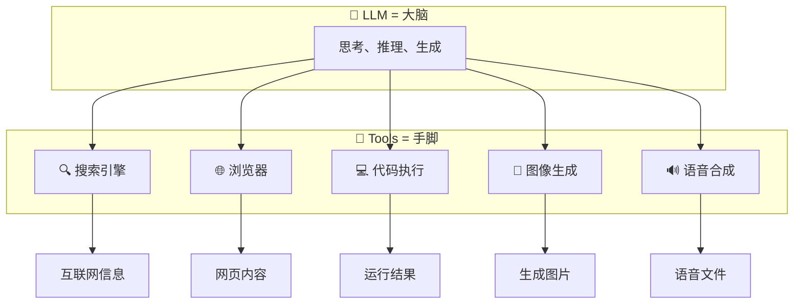
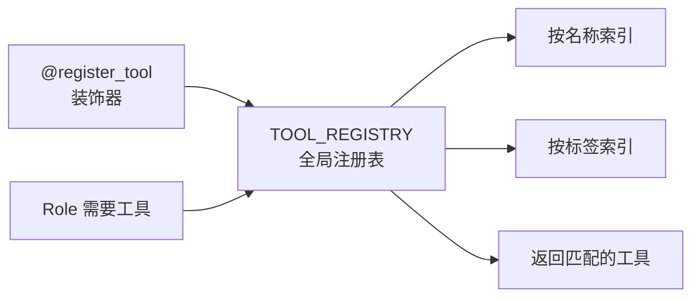
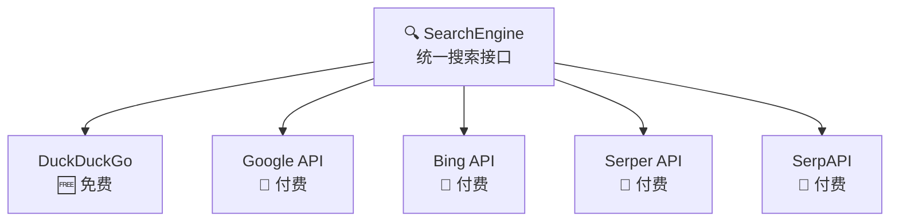
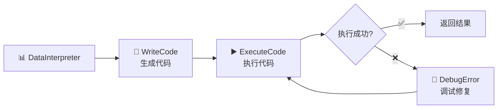
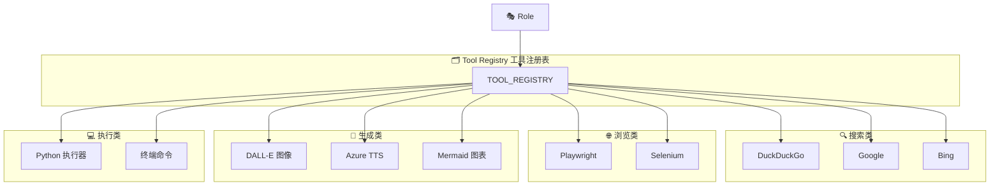

# 🔧 第九章：Tools 工具系统

> 🎯 本章目标：了解 MetaGPT 的工具注册机制，掌握搜索引擎、浏览器等内置工具的使用。

---

## 9.1 💡 为什么需要工具系统？

LLM 虽然强大，但有一些天然的局限：

- ❌ **不能上网** — 知识有截止日期，无法获取最新信息
- ❌ **不能执行代码** — 只能生成代码，无法验证运行结果
- ❌ **不能操作文件** — 无法读写本地文件系统
- ❌ **不能调用 API** — 无法与外部服务交互

**工具系统**正是为了弥补这些不足——给智能体装上「手和脚」。

### 通俗比喻 🧰

如果把 LLM 比作一个聪明的大脑：

- **没有工具** ❌：光想不能动手，只能「纸上谈兵」
- **有了工具** ✅：能上网搜索、运行代码、操作文件——真正的「全能员工」



---

## 9.2 📐 工具注册机制

MetaGPT 使用**注册表模式**管理工具：

```python
class ToolRegistry(BaseModel):
    """工具注册表——所有工具的「名录」"""
    
    tools: dict = {}                      # 名称 → 工具
    tools_by_tags: dict = defaultdict(dict)  # 标签 → {名称 → 工具}
    
    def register_tool(self, tool_name, tool_path, schemas=None, tags=None):
        """注册一个新工具"""
    
    def get_tool(self, key) -> Tool:
        """按名称获取工具"""
    
    def get_tools_by_tag(self, key):
        """按标签获取一组工具"""

# 全局注册表实例
TOOL_REGISTRY = ToolRegistry()
```

### 使用装饰器注册工具

```python
from metagpt.tools.tool_registry import register_tool

@register_tool(tags=["search", "web"])
class MySearchTool:
    """自定义搜索工具"""
    
    async def run(self, query: str) -> str:
        # 搜索逻辑
        return results
```

### 工具注册流程



> 💡 **设计原理**：为什么用注册表？因为工具可能来自不同模块、不同包。注册表提供了一个统一的「查找中心」，角色只需要按名称或标签查找，不需要知道工具的具体位置。类似于公司的「设备管理系统」——需要打印机？去系统查一下哪里有。

---

## 9.3 🔍 搜索引擎工具

MetaGPT 内置了多种搜索引擎适配：

### 支持的搜索引擎



### 配置搜索引擎

```yaml
# config2.yaml
search:
  api_type: "ddg"           # 搜索引擎类型
  api_key: ""               # API Key（DuckDuckGo 不需要）
```

### 使用示例

```python
from metagpt.tools.search_engine import SearchEngine

# 创建搜索引擎实例
engine = SearchEngine(engine_type="ddg")

# 执行搜索
results = await engine.run("MetaGPT 多智能体框架")
print(results)
# 返回搜索结果列表
```

### 搜索在角色中的应用

内置的 `Researcher` 角色就使用了搜索工具：

```python
class Researcher(Role):
    """研究员角色——能搜索互联网"""
    
    def __init__(self, **kwargs):
        super().__init__(**kwargs)
        self.set_actions([
            CollectLinks,            # 收集相关链接
            WebBrowseAndSummarize,   # 浏览网页并总结
            ConductResearch          # 整合研究报告
        ])
```

---

## 9.4 🌐 浏览器工具

MetaGPT 支持通过浏览器获取网页内容：

### 浏览器引擎

```python
# 支持两种浏览器引擎
class WebBrowserEngineType(Enum):
    PLAYWRIGHT = "playwright"    # Playwright（推荐）
    SELENIUM = "selenium"        # Selenium
```

### 配置浏览器

```yaml
# config2.yaml
browser:
  engine: "playwright"       # 浏览器引擎
  browser_type: "chromium"   # 浏览器类型
```

### 使用示例

```python
from metagpt.tools.web_browser_engine import WebBrowserEngine

# 创建浏览器引擎
browser = WebBrowserEngine(engine_type="playwright")

# 访问网页
page_content = await browser.run("https://example.com")
print(page_content)  # 返回网页文本内容
```

---

## 9.5 🎨 多媒体工具

### 图像生成

```python
from metagpt.tools.openai_text_to_image import OpenAIText2Image

# DALL-E 图像生成
t2i = OpenAIText2Image()
image_url = await t2i.run("一只戴眼镜的猫在写代码")
```

### 语音合成

```python
# Azure TTS
from metagpt.tools.azure_tts import AzureTTS

tts = AzureTTS()
audio_data = await tts.run("Hello, I am MetaGPT!")
```

### Mermaid 图表生成

```python
# Mermaid 图表渲染
from metagpt.tools.mermaid import MermaidEngine

engine = MermaidEngine()
image = await engine.run("""
graph LR
    A --> B --> C
""")
```

---

## 9.6 💻 代码执行工具

MetaGPT 支持在沙箱中执行代码：

```python
# 代码执行（在 DataInterpreter 中使用）
class ExecuteCode(Action):
    """执行 Python 代码"""
    
    async def run(self, code: str) -> str:
        # 在安全沙箱中执行代码
        # 捕获输出和错误
        result = execute_in_sandbox(code)
        return result
```

### DataInterpreter 的工具链



---

## 9.7 🏗️ 自定义工具

### 创建自定义工具

```python
from metagpt.tools.tool_registry import register_tool

@register_tool(tags=["database", "query"])
class DatabaseTool:
    """数据库查询工具"""
    
    def __init__(self, connection_string: str):
        self.conn = connect(connection_string)
    
    async def query(self, sql: str) -> list:
        """执行 SQL 查询"""
        return self.conn.execute(sql).fetchall()
    
    async def insert(self, table: str, data: dict):
        """插入数据"""
        self.conn.execute(f"INSERT INTO {table} ...", data)
```

### 在角色中使用自定义工具

```python
class DataAnalyst(Role):
    """数据分析师——使用数据库工具"""
    
    def __init__(self, db_tool: DatabaseTool, **kwargs):
        super().__init__(**kwargs)
        self.db_tool = db_tool
        self.set_actions([AnalyzeData])
    
    async def _act(self) -> Message:
        # 使用工具查询数据
        data = await self.db_tool.query("SELECT * FROM sales")
        
        # 用 LLM 分析数据
        analysis = await self.rc.todo.run(str(data))
        
        return Message(content=analysis)
```

---

## 9.8 🗂️ 工具系统架构总览



---

## 9.9 📝 本章小结

| 概念 | 说明 |
|------|------|
| **ToolRegistry** | 全局工具注册表，统一管理所有工具 |
| **@register_tool** | 装饰器，自动注册工具到全局表 |
| **SearchEngine** | 搜索引擎统一接口，支持多种后端 |
| **WebBrowserEngine** | 浏览器引擎，获取网页内容 |
| **代码执行** | 在安全沙箱中运行代码 |
| **多媒体工具** | 图像生成、语音合成等 |

### 设计亮点 ✨

1. **注册表模式** — 统一管理，按需查找，解耦工具与使用者
2. **多后端适配** — 搜索引擎、浏览器等都支持多种后端实现
3. **可扩展** — 通过 `@register_tool` 轻松添加自定义工具
4. **标签分类** — 按标签组织工具，方便按类别检索

## ➡️ 下一章

掌握了所有核心概念后，让我们动手实践！进入 [第十章：实战 - 构建自定义 Agent](./10-build-custom-agent.md)！
