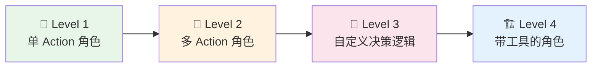
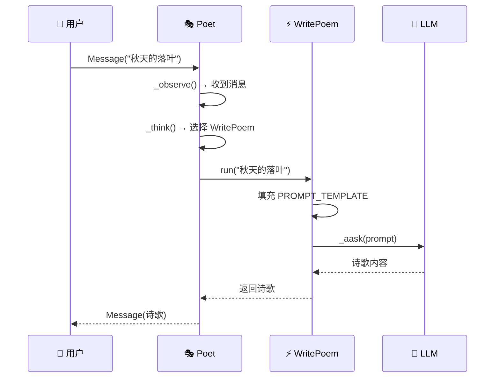
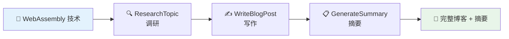
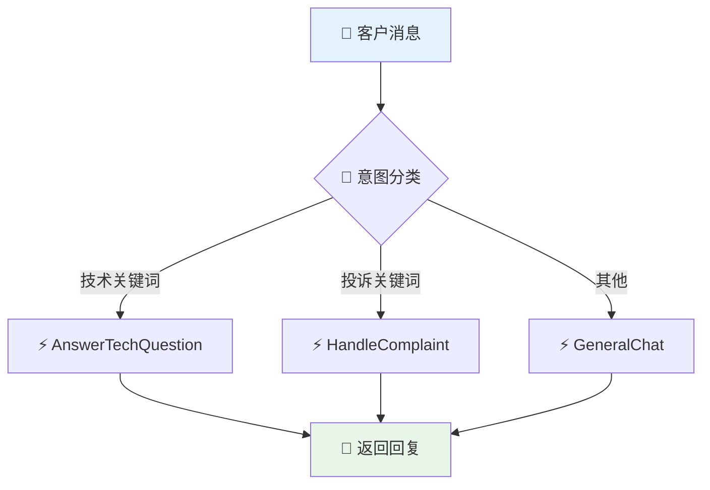
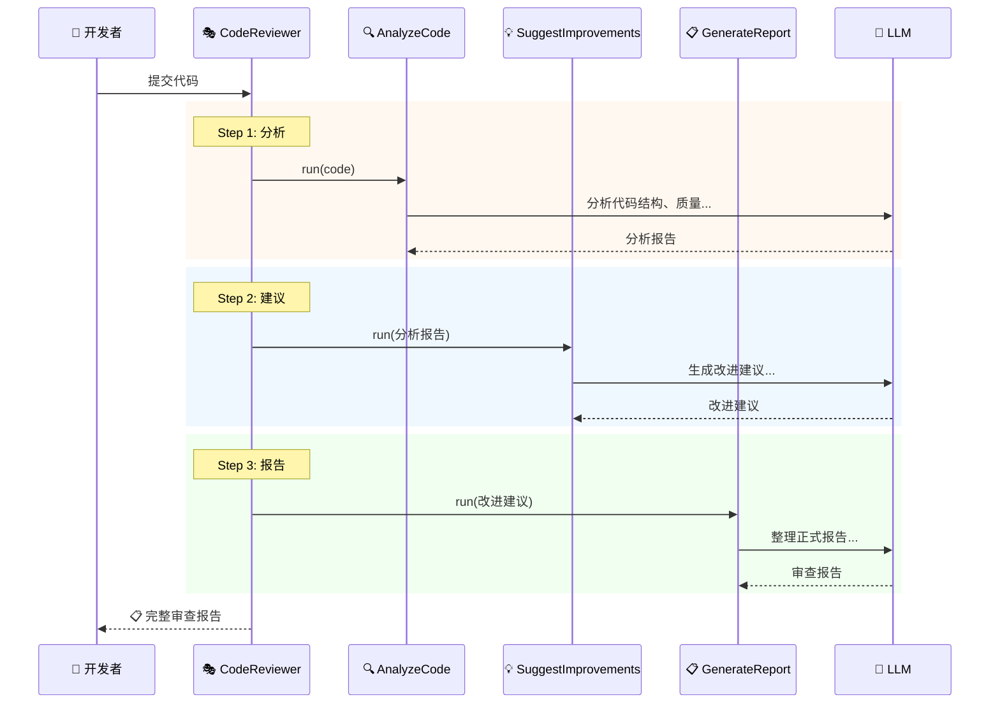

# 🛠️ 第十章：实战 - 构建自定义 Agent

> 🎯 本章目标：从零开始创建一个完整的自定义智能体，融会贯通前面学到的所有概念。

---

## 10.1 💡 从简单到复杂

构建自定义 Agent 的学习路径：



---

## 10.2 🌱 Level 1：单 Action 角色

最简单的智能体——只有一个技能。

### 示例：诗人 Agent

```python
"""poet_agent.py - 一个会写诗的智能体"""
import asyncio
from metagpt.actions import Action
from metagpt.roles import Role
from metagpt.schema import Message


# ============ Step 1: 定义 Action ============

class WritePoem(Action):
    """写诗的动作"""
    name: str = "WritePoem"
    
    PROMPT_TEMPLATE: str = """
你是一位才华横溢的诗人。请根据以下主题创作一首诗。

## 主题
{topic}

## 要求
- 风格：{style}
- 行数：4-8 行
- 语言优美，意境深远
- 适当使用修辞手法

## 诗作
"""
    
    async def run(self, topic: str, style: str = "现代诗") -> str:
        prompt = self.PROMPT_TEMPLATE.format(topic=topic, style=style)
        poem = await self._aask(prompt)
        return poem


# ============ Step 2: 定义 Role ============

class Poet(Role):
    """诗人角色"""
    name: str = "李白二号"
    profile: str = "Poet"
    goal: str = "创作优美的诗歌"
    constraints: str = "诗歌要有意境，避免直白"
    
    def __init__(self, **kwargs):
        super().__init__(**kwargs)
        self.set_actions([WritePoem])


# ============ Step 3: 运行 ============

async def main():
    poet = Poet()
    msg = Message(content="秋天的落叶")
    result = await poet.run(msg)
    print(f"🎭 {poet.name} 的创作：\n{result.content}")

asyncio.run(main())
```

### 代码解析



---

## 10.3 🌿 Level 2：多 Action 角色

一个角色拥有多个技能，按顺序执行。

### 示例：技术博主 Agent

```python
"""tech_blogger.py - 技术博主：先调研，再写文章，最后生成摘要"""
import asyncio
from metagpt.actions import Action
from metagpt.roles import Role
from metagpt.schema import Message


# ============ 3 个 Action ============

class ResearchTopic(Action):
    """调研主题"""
    name: str = "ResearchTopic"
    
    async def run(self, topic: str) -> str:
        prompt = f"""请对以下技术主题进行调研分析：

主题：{topic}

请提供：
1. 技术背景和发展历史
2. 核心原理（3-5 个要点）
3. 应用场景
4. 优缺点分析
5. 发展趋势

请输出详细的调研报告。"""
        return await self._aask(prompt)


class WriteBlogPost(Action):
    """撰写博客文章"""
    name: str = "WriteBlogPost"
    
    async def run(self, research: str) -> str:
        prompt = f"""基于以下调研报告，撰写一篇技术博客文章。

## 调研报告
{research}

## 写作要求
- 标题吸引人
- 开头用一个生动的例子引入
- 内容通俗易懂，适合初学者
- 包含代码示例（如果适用）
- 结尾有总结和展望
- 字数 800-1500 字
- 使用 Markdown 格式

## 博客文章
"""
        return await self._aask(prompt)


class GenerateSummary(Action):
    """生成文章摘要"""
    name: str = "GenerateSummary"
    
    async def run(self, article: str) -> str:
        prompt = f"""请为以下博客文章生成：
1. 一句话摘要（30字以内）
2. 3-5 个关键标签
3. 适合的社交媒体分享文案（100字以内）

## 文章
{article}

## 输出
"""
        return await self._aask(prompt)


# ============ 博主 Role ============

class TechBlogger(Role):
    """技术博主——调研、写作、生成摘要"""
    name: str = "小博"
    profile: str = "TechBlogger"
    goal: str = "撰写高质量的技术博客文章"
    
    def __init__(self, **kwargs):
        super().__init__(**kwargs)
        # 按顺序执行三个动作
        self.set_actions([ResearchTopic, WriteBlogPost, GenerateSummary])
        self._set_react_mode("by_order")  # 🔑 关键：按顺序执行


# ============ 运行 ============

async def main():
    blogger = TechBlogger()
    result = await blogger.run(Message(content="WebAssembly 技术"))
    print(result.content)

asyncio.run(main())
```

### 执行流程



---

## 10.4 🌳 Level 3：自定义决策逻辑

重写 `_think` 或 `_act` 方法，实现自定义决策。

### 示例：智能客服 Agent

```python
"""smart_cs.py - 智能客服：根据问题类型选择不同处理方式"""
import asyncio
from metagpt.actions import Action
from metagpt.roles import Role
from metagpt.schema import Message


class AnswerTechQuestion(Action):
    """回答技术问题"""
    name: str = "AnswerTechQuestion"
    
    async def run(self, question: str) -> str:
        return await self._aask(
            f"作为技术支持专家，请回答以下技术问题：\n{question}"
        )


class HandleComplaint(Action):
    """处理投诉"""
    name: str = "HandleComplaint"
    
    async def run(self, complaint: str) -> str:
        return await self._aask(
            f"作为客服经理，请妥善处理以下客户投诉，语气温和、态度诚恳：\n{complaint}"
        )


class GeneralChat(Action):
    """日常聊天"""
    name: str = "GeneralChat"
    
    async def run(self, message: str) -> str:
        return await self._aask(
            f"作为友善的客服，请回应以下消息：\n{message}"
        )


class SmartCustomerService(Role):
    """智能客服——根据问题类型自动选择处理策略"""
    name: str = "小服"
    profile: str = "CustomerService"
    goal: str = "为客户提供满意的服务"
    
    def __init__(self, **kwargs):
        super().__init__(**kwargs)
        self.set_actions([AnswerTechQuestion, HandleComplaint, GeneralChat])
    
    async def _think(self) -> bool:
        """🔑 自定义思考逻辑：分类问题并选择对应 Action"""
        
        # 获取最新消息
        news = self.rc.news
        if not news:
            return False
        
        latest_msg = news[-1].content.lower()
        
        # 简单的意图分类（实际可以用 LLM 分类）
        if any(kw in latest_msg for kw in ["bug", "错误", "报错", "不能用", "怎么用"]):
            self.set_todo(self.actions[0])  # 技术问题
        elif any(kw in latest_msg for kw in ["投诉", "不满", "太差", "退款", "差评"]):
            self.set_todo(self.actions[1])  # 投诉处理
        else:
            self.set_todo(self.actions[2])  # 日常聊天
        
        return True


async def main():
    cs = SmartCustomerService()
    
    # 测试不同类型的问题
    questions = [
        "你们的软件报错了，怎么解决？",
        "我要投诉！服务态度太差了！",
        "你好，今天天气不错",
    ]
    
    for q in questions:
        result = await cs.run(Message(content=q))
        print(f"❓ 问题：{q}")
        print(f"💬 回答：{result.content}\n{'='*50}\n")

asyncio.run(main())
```

### 决策流程



---

## 10.5 🏗️ Level 4：完整实战项目

### 示例：代码审查助手

一个能阅读代码、分析问题、给出建议的完整智能体：

```python
"""code_reviewer.py - 代码审查助手"""
import asyncio
from metagpt.actions import Action
from metagpt.roles import Role
from metagpt.schema import Message


class AnalyzeCode(Action):
    """分析代码结构"""
    name: str = "AnalyzeCode"
    
    async def run(self, code: str) -> str:
        prompt = f"""请分析以下代码的结构和质量：

```
{code}
```

请从以下维度分析：
1. **代码结构**：函数/类的组织是否合理
2. **命名规范**：变量、函数命名是否清晰
3. **错误处理**：是否有适当的异常处理
4. **性能**：是否有明显的性能问题
5. **安全**：是否有安全隐患

请输出分析报告。"""
        return await self._aask(prompt)


class SuggestImprovements(Action):
    """提供改进建议"""
    name: str = "SuggestImprovements"
    
    async def run(self, analysis: str) -> str:
        prompt = f"""基于以下代码分析报告，提供具体的改进建议：

## 分析报告
{analysis}

## 要求
- 每个问题给出**具体的修改方案**
- 提供**修改后的代码示例**
- 按**优先级**排序（高/中/低）
- 解释**为什么要这样改**

## 改进建议
"""
        return await self._aask(prompt)


class GenerateReviewReport(Action):
    """生成审查报告"""
    name: str = "GenerateReviewReport"
    
    async def run(self, suggestions: str) -> str:
        prompt = f"""请将以下改进建议整理为一份正式的代码审查报告：

{suggestions}

## 报告格式
### 📊 总体评分：X/10

### 🔴 必须修改
- ...

### 🟡 建议修改
- ...

### 🟢 锦上添花
- ...

### 📝 总结
"""
        return await self._aask(prompt)


class CodeReviewer(Role):
    """代码审查助手"""
    name: str = "Review 大师"
    profile: str = "CodeReviewer"
    goal: str = "提供专业、详细的代码审查"
    constraints: str = "建议要具体可操作，不能模糊"
    
    def __init__(self, **kwargs):
        super().__init__(**kwargs)
        self.set_actions([AnalyzeCode, SuggestImprovements, GenerateReviewReport])
        self._set_react_mode("by_order")


async def main():
    reviewer = CodeReviewer()
    
    code = """
def calc(x,y,op):
    if op=='+': return x+y
    if op=='-': return x-y
    if op=='*': return x*y
    if op=='/': return x/y
    
data = []
for i in range(1000000):
    data.append(i*2)
    
import pickle
user_input = input("Enter data: ")
result = pickle.loads(user_input)
"""
    
    result = await reviewer.run(Message(content=code))
    print(f"📋 审查报告：\n{result.content}")

asyncio.run(main())
```

### 完整执行流程



---

## 10.6 📋 自定义 Agent 检查清单

创建一个新的 Agent 时，参考以下检查清单：

### ✅ 设计阶段
- [ ] 明确 Agent 的**目标**是什么
- [ ] 确定需要哪些**技能**（Action）
- [ ] 选择合适的**反应模式**（REACT / BY_ORDER / PLAN_AND_ACT）
- [ ] 确定需要**订阅**哪些消息

### ✅ 实现阶段
- [ ] 定义每个 **Action** 并编写 Prompt 模板
- [ ] 定义 **Role** 并配置 Action 列表
- [ ] 设置 `_watch` 订阅关系
- [ ] 决定是否需要重写 `_think` / `_act` / `_observe`

### ✅ 测试阶段
- [ ] 单独测试每个 **Action** 的输出质量
- [ ] 测试 **Role** 的完整执行流程
- [ ] 测试异常情况下的行为
- [ ] 检查 LLM 费用是否在预期范围内

---

## 10.7 📝 本章小结

| Level | 难度 | 特点 |
|-------|------|------|
| Level 1 | ⭐ | 单 Action，最简单的智能体 |
| Level 2 | ⭐⭐ | 多 Action 按序执行，流水线模式 |
| Level 3 | ⭐⭐⭐ | 自定义决策逻辑，智能选择 Action |
| Level 4 | ⭐⭐⭐⭐ | 完整项目，多步骤复杂任务 |

### 最佳实践 💎

1. **Prompt 是灵魂** — Action 的质量 90% 取决于 Prompt
2. **先简后繁** — 从单 Action 开始，逐步增加复杂度
3. **明确分工** — 每个 Action 只做一件事
4. **测试驱动** — 先测试单个 Action，再测试整体流程

## ➡️ 下一章

单个 Agent 的能力有限，多个 Agent 协作才能发挥真正的威力。让我们进入 [第十一章：实战 - 多智能体协作](./11-multi-agent-collaboration.md)！
