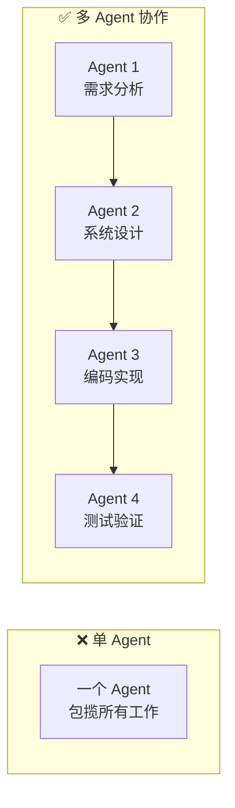
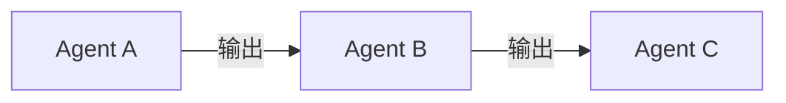
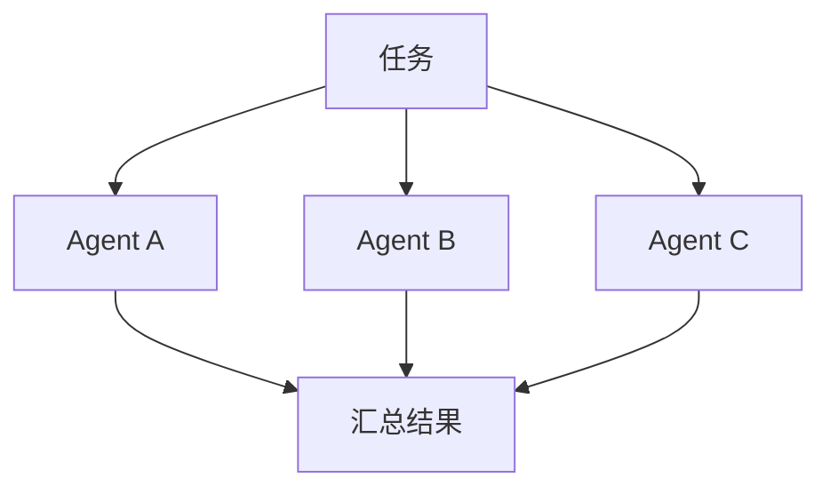
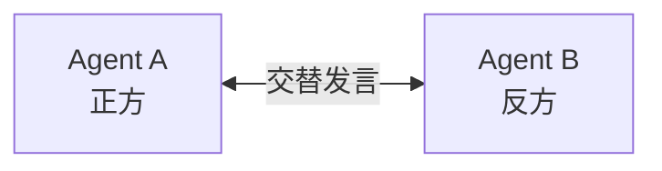
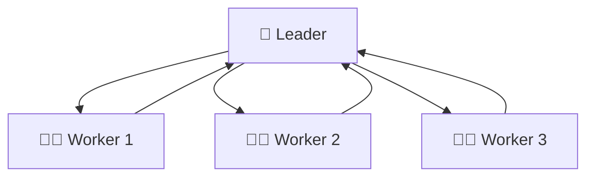
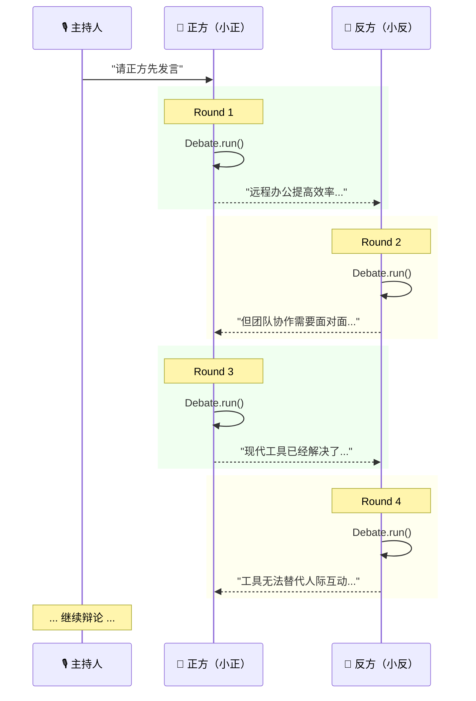
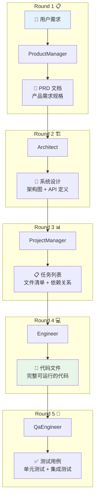
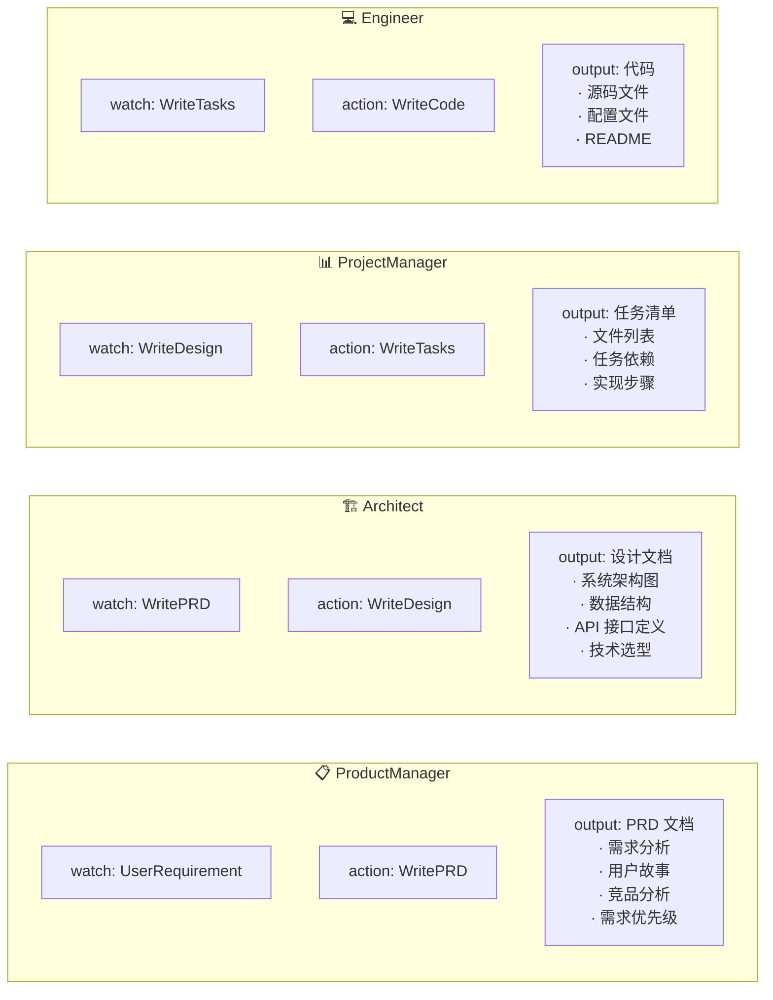
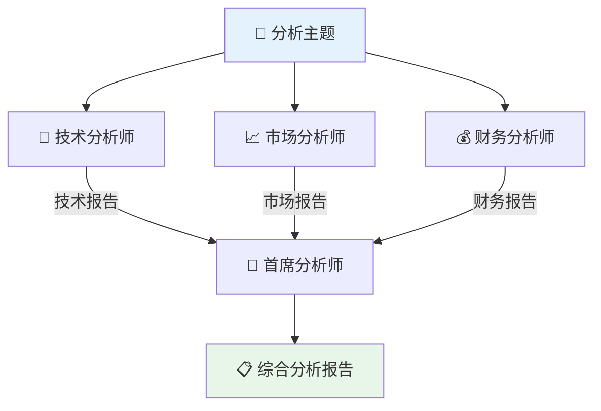
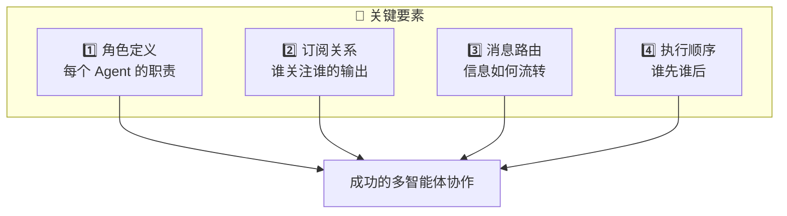

# 🤝 第十一章：实战 - 多智能体协作

> 🎯 本章目标：掌握多智能体协作的设计模式，实现辩论系统和软件公司模拟。

---

## 11.1 💡 从单体到团队

单个 Agent 就像一个「独行侠」，虽然能力不错，但面对复杂任务时力不从心。多智能体协作让多个 Agent 各展所长，形成真正的「团队力量」。

### 通俗比喻 🏀

- **单个 Agent** = 一个人打篮球（一个人运球、传球、投篮，效率低）
- **多 Agent 协作** = 一支篮球队（控球后卫传球、小前锋突破、中锋抢篮板，各司其职）



---

## 11.2 📐 多智能体协作模式

### 模式一：串行流水线 🔗



**特点**：后一个 Agent 的输入是前一个的输出，像工厂流水线。

**适用场景**：步骤明确的线性任务（如软件开发流程）。

### 模式二：并行协作 ⚡



**特点**：多个 Agent 同时工作，最后汇总结果。

**适用场景**：独立子任务的并行处理（如多角度分析）。

### 模式三：辩论对抗 🗣️



**特点**：两个或多个 Agent 对同一话题发表不同观点，通过辩论提升答案质量。

**适用场景**：需要多角度思考的决策问题。

### 模式四：层级管理 🏛️



**特点**：有一个「管理者」Agent 分配任务，「执行者」Agent 汇报结果。

**适用场景**：复杂项目管理。

---

## 11.3 💬 实战一：辩论系统

让两个 Agent 对一个话题展开辩论：

```python
"""debate.py - 多智能体辩论系统"""
import asyncio
from metagpt.actions import Action
from metagpt.roles import Role
from metagpt.schema import Message
from metagpt.team import Team
from metagpt.environment import Environment


# ============ Actions ============

class Debate(Action):
    """辩论发言动作"""
    name: str = "Debate"
    
    PROMPT_TEMPLATE: str = """
你正在参加一场辩论，你的立场是：{stance}

## 辩论规则
1. 针对对方的观点进行有理有据的反驳
2. 提出自己的新论点
3. 用事实和逻辑说话，避免人身攻击
4. 每次发言控制在 100 字以内

## 对方的最新发言
{opponent_speech}

## 你的回应
"""
    
    async def run(self, opponent_speech: str, stance: str) -> str:
        prompt = self.PROMPT_TEMPLATE.format(
            stance=stance,
            opponent_speech=opponent_speech
        )
        return await self._aask(prompt)


# ============ Roles ============

class Debater(Role):
    """辩手角色"""
    name: str = ""
    profile: str = "Debater"
    stance: str = ""  # 立场
    opponent_name: str = ""  # 对手名称
    
    def __init__(self, **kwargs):
        super().__init__(**kwargs)
        self.set_actions([Debate])
        self._watch([Debate])  # 订阅对方的发言
    
    async def _observe(self) -> int:
        """只观察对手的发言"""
        await super()._observe()
        # 过滤：只保留对手的消息
        self.rc.news = [
            msg for msg in self.rc.news
            if msg.sent_from != self.name  # 不是自己发的
        ]
        return len(self.rc.news)
    
    async def _act(self) -> Message:
        """使用自己的立场进行辩论"""
        todo = self.rc.todo
        
        # 获取对方最新发言
        opponent_speech = ""
        if self.rc.news:
            opponent_speech = self.rc.news[-1].content
        
        # 执行辩论
        response = await todo.run(
            opponent_speech=opponent_speech,
            stance=self.stance
        )
        
        msg = Message(
            content=response,
            role="assistant",
            cause_by=type(todo),
            sent_from=self.name,
            send_to=self.opponent_name
        )
        
        return msg


# ============ 运行辩论 ============

async def main():
    # 创建两位辩手
    debater_pro = Debater(
        name="小正",
        stance="支持远程办公：远程办公提高效率、节省通勤、提升生活质量",
        opponent_name="小反"
    )
    
    debater_con = Debater(
        name="小反",
        stance="反对远程办公：办公室工作更利于团队协作、沟通效率和公司文化建设",
        opponent_name="小正"
    )
    
    # 组建团队
    env = Environment(desc="关于远程办公的辩论赛场")
    team = Team(env=env)
    team.hire([debater_pro, debater_con])
    team.invest(3.0)
    
    # 开始辩论
    await team.run(
        idea="辩论主题：远程办公 vs 办公室办公，哪种方式更好？请正方先发言。",
        send_to="小正",  # 让正方先发言
        n_round=6         # 6 轮辩论
    )

asyncio.run(main())
```

### 辩论流程图



---

## 11.4 🏢 实战二：软件公司模拟

MetaGPT 最经典的应用——模拟一个完整的软件公司：

```python
"""software_company.py - 软件公司模拟"""
import asyncio
from metagpt.team import Team
from metagpt.roles import (
    ProductManager,
    Architect,
    ProjectManager,
    Engineer,
)


async def startup(idea: str, investment: float = 5.0, n_round: int = 5):
    """启动一个软件公司"""
    
    # 1. 创建团队
    team = Team()
    
    # 2. 招聘团队成员
    team.hire([
        ProductManager(),    # 📋 产品经理
        Architect(),         # 🏗️ 架构师
        ProjectManager(),    # 📊 项目经理
        Engineer(n_borg=5),  # 💻 工程师（最多写5个文件）
    ])
    
    # 3. 设置预算
    team.invest(investment)
    
    # 4. 开始工作
    await team.run(idea=idea, n_round=n_round)


async def main():
    await startup(
        idea="开发一个命令行版本的贪吃蛇游戏，使用 Python 实现",
        investment=5.0,
        n_round=5
    )

asyncio.run(main())
```

### 软件公司工作流程



### 各角色详细职责



---

## 11.5 🎮 实战三：多角度分析系统

多个 Agent 从不同视角分析同一个问题：

```python
"""multi_analyst.py - 多角度分析系统"""
import asyncio
from metagpt.actions import Action
from metagpt.roles import Role
from metagpt.schema import Message
from metagpt.team import Team
from metagpt.environment import Environment


class AnalyzeFromPerspective(Action):
    """从特定视角分析"""
    name: str = "Analyze"
    perspective: str = ""
    
    async def run(self, topic: str) -> str:
        return await self._aask(
            f"请从{self.perspective}的角度分析以下话题，"
            f"提供 3-5 个关键洞察：\n{topic}"
        )


class Synthesize(Action):
    """综合所有分析"""
    name: str = "Synthesize"
    
    async def run(self, analyses: str) -> str:
        return await self._aask(
            f"请综合以下多个角度的分析，生成一份全面的报告：\n{analyses}"
        )


class Analyst(Role):
    """分析师角色"""
    perspective: str = ""
    
    def __init__(self, perspective: str, **kwargs):
        super().__init__(**kwargs)
        self.perspective = perspective
        action = AnalyzeFromPerspective()
        action.perspective = perspective
        self.set_actions([action])


class ChiefAnalyst(Role):
    """首席分析师——综合各方观点"""
    name: str = "首席分析师"
    profile: str = "ChiefAnalyst"
    
    def __init__(self, **kwargs):
        super().__init__(**kwargs)
        self.set_actions([Synthesize])
        self._watch([AnalyzeFromPerspective])  # 订阅所有分析师的输出


async def main():
    env = Environment(desc="多角度分析室")
    team = Team(env=env)
    team.hire([
        Analyst(name="技术视角", profile="TechAnalyst", 
                perspective="技术可行性"),
        Analyst(name="市场视角", profile="MarketAnalyst",
                perspective="市场需求和竞争"),
        Analyst(name="财务视角", profile="FinanceAnalyst",
                perspective="投资回报和财务风险"),
        ChiefAnalyst(),  # 综合分析
    ])
    
    team.invest(5.0)
    await team.run(
        idea="分析：一家传统制造企业是否应该引入 AI 质检系统？",
        n_round=4
    )

asyncio.run(main())
```

### 多角度分析流程



---

## 11.6 📋 协作模式选择指南

| 场景 | 推荐模式 | 原因 |
|------|---------|------|
| 软件开发 | 串行流水线 | 步骤有明确的依赖关系 |
| 观点辩论 | 辩论对抗 | 需要正反对立的观点 |
| 多维分析 | 并行协作 | 各维度分析相互独立 |
| 项目管理 | 层级管理 | 需要统一协调和任务分配 |
| 内容创作 | 串行流水线 | 调研→创作→审核有顺序 |
| 决策评估 | 辩论 + 综合 | 先辩论再由仲裁者总结 |

---

## 11.7 📝 本章小结

| 概念 | 说明 |
|------|------|
| **串行流水线** | 角色按固定顺序协作 |
| **并行协作** | 多角色同时工作，最后汇总 |
| **辩论对抗** | 角色持不同立场交替发言 |
| **层级管理** | 管理者分配任务，执行者汇报 |

### 多智能体协作的关键要素



### 设计亮点 ✨

1. **灵活组合** — 通过 `_watch` 和 `send_to` 自由编排协作关系
2. **松耦合** — 角色之间通过消息通信，不直接依赖
3. **可扩展** — 随时添加或替换角色，不影响其他角色
4. **并发高效** — 无依赖的角色自动并发执行

## ➡️ 下一章

你已经能构建单个 Agent 和多 Agent 系统了！最后让我们深入 MetaGPT 的架构设计，理解「为什么这么设计」。进入 [第十二章：进阶 - 架构设计与原理](./12-architecture-deep-dive.md)！
