# 🏗️ 第十二章：进阶 - 架构设计与原理

> 🎯 本章目标：深入理解 MetaGPT 的架构设计哲学，掌握设计模式和源码原理。

---

## 12.1 🎯 设计哲学

### 核心理念回顾

MetaGPT 的设计基于一个深刻的洞察：

> **现实世界中，优秀的软件不是由一个天才写出来的，而是由一个遵循规范流程的团队协作产出的。**

这个洞察转化为 MetaGPT 的核心公式：

```
Code = SOP(Team)
```

### 与其他框架的对比

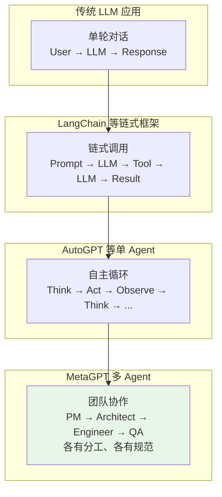

**MetaGPT 的独特之处**：

| 特征 | 其他框架 | MetaGPT |
|------|---------|---------|
| Agent 模型 | 通用 Agent | **专业角色**（模拟真实岗位） |
| 协作方式 | 无/简单链 | **SOP 流程**（标准化操作） |
| 输出质量 | 依赖 prompt | **结构化约束**（ActionNode） |
| 通信机制 | 直接调用 | **消息驱动**（发布-订阅） |
| 状态管理 | 简单变量 | **多层记忆**（工作/短期/长期） |

---

## 12.2 🏛️ 架构全景图

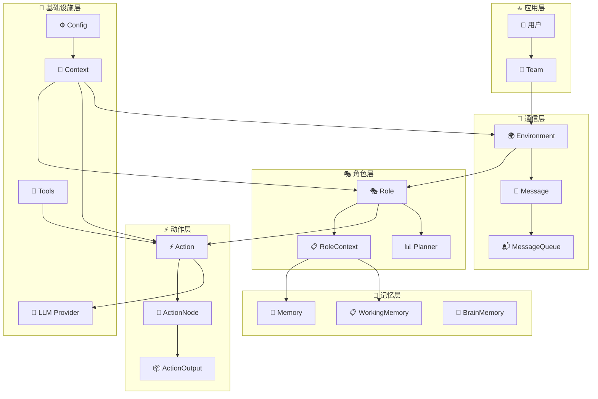

### 分层说明

| 层次 | 职责 | 核心类 |
|------|------|--------|
| **应用层** | 用户交互入口 | Team |
| **角色层** | 智能体行为定义 | Role, RoleContext |
| **动作层** | 具体任务执行 | Action, ActionNode |
| **通信层** | 消息传递与路由 | Environment, Message |
| **记忆层** | 状态管理与持久化 | Memory, BrainMemory |
| **基础设施层** | 底层支撑服务 | LLM, Tools, Config |

---

## 12.3 🎨 核心设计模式

### 1️⃣ 观察者模式（Observer Pattern）

**在哪里用？** 消息系统

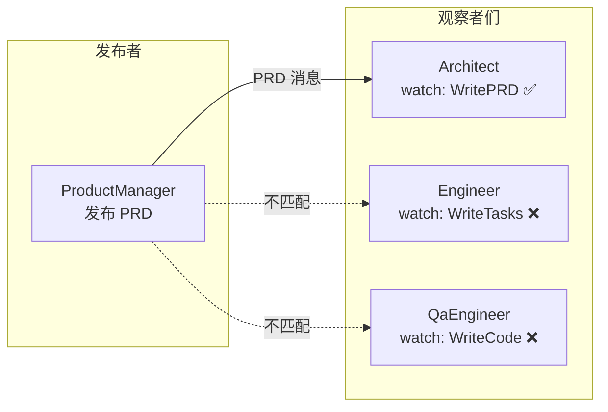

**为什么用？** 解耦。角色不需要知道「谁会处理我的输出」，只管发布消息。订阅者自动接收。

**现实类比**：微信公众号。你发文章不需要知道谁在看，关注了的人自动收到推送。

### 2️⃣ 状态机模式（State Machine）

**在哪里用？** Role 的 Action 选择

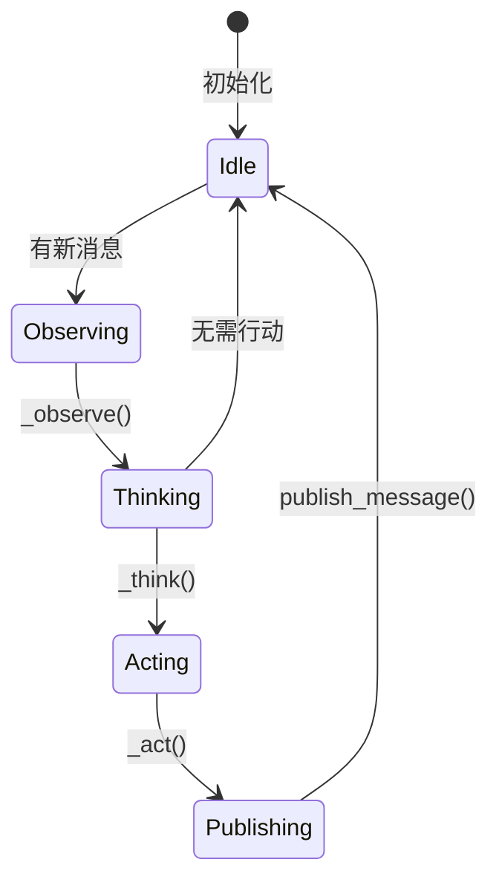

**为什么用？** 清晰的状态转换让角色行为可预测、可调试。

### 3️⃣ 策略模式（Strategy Pattern）

**在哪里用？** ReactMode

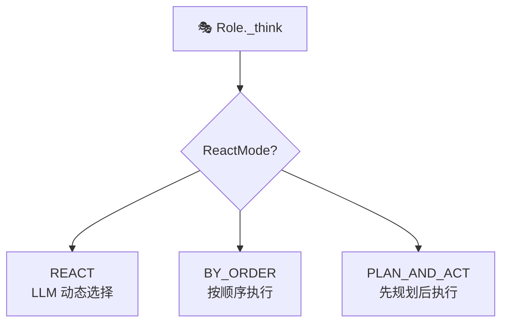

**为什么用？** 同一个角色可以切换不同的决策策略，无需修改核心代码。

### 4️⃣ 依赖注入（Dependency Injection）

**在哪里用？** ContextMixin

```python
class ContextMixin(BaseModel):
    """通过 Mixin 注入 Context、Config、LLM"""
    
    @property
    def context(self) -> Context:
        return self.private_context or default_context
    
    @property
    def llm(self) -> BaseLLM:
        return self.private_llm or self.context.llm()
```

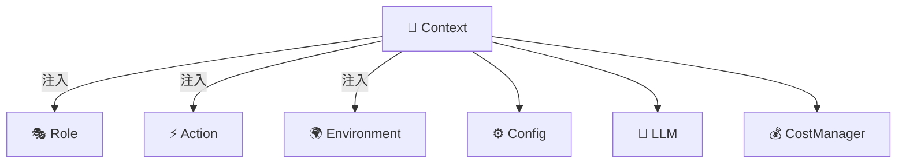

**为什么用？** 
- 角色和动作不需要自己创建 LLM、Config 等依赖
- 方便替换（如测试时用 Mock LLM）
- 统一管理全局状态

### 5️⃣ 工厂模式（Factory Pattern）

**在哪里用？** LLM Provider 创建

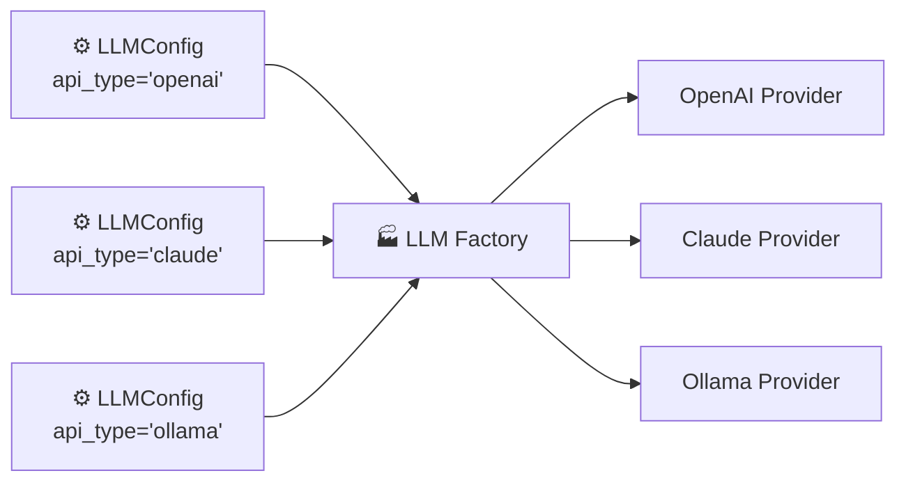

**为什么用？** 用户只需要改配置文件中的 `api_type`，框架自动创建对应的 Provider 实例。

---

## 12.4 🔬 核心流程源码解读

### Team.run() 的完整执行流程

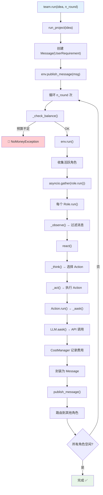

### 消息路由的核心算法

```python
# Environment.publish_message 的核心逻辑
def publish_message(self, message: Message):
    """消息路由算法"""
    
    # Step 1: 记录到历史
    self.history.add(message)
    
    # Step 2: 遍历所有角色
    for role, addrs in self.member_addrs.items():
        # Step 3: 匹配规则
        if is_send_to(message, addrs):
            # Step 4: 投递到角色的消息队列
            role.put_message(message)

# 匹配规则
def is_send_to(message, addresses):
    """
    规则优先级：
    1. send_to 包含 MESSAGE_ROUTE_TO_ALL → 所有人收到
    2. send_to 与 addresses 有交集 → 匹配的人收到
    3. 都不匹配 → 不投递
    """
    if MESSAGE_ROUTE_TO_ALL in message.send_to:
        return True
    return bool(message.send_to & addresses)
```

---

## 12.5 🧩 扩展点与定制化

MetaGPT 提供了丰富的扩展点：

### 可扩展的组件

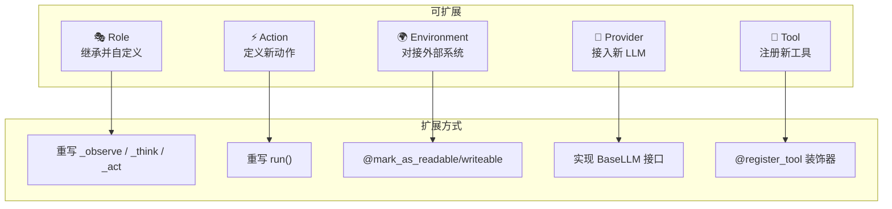

### 扩展示例：自定义序列化

```python
from metagpt.utils.serialize import SerializationMixin

class MyRole(Role, SerializationMixin):
    """支持序列化的自定义角色"""
    custom_data: dict = {}
    
    def serialize(self, path):
        """保存角色状态"""
        data = {
            "name": self.name,
            "profile": self.profile,
            "custom_data": self.custom_data,
            "memory": self.rc.memory.serialize()
        }
        save_to_file(path, data)
    
    @classmethod
    def deserialize(cls, path):
        """恢复角色状态"""
        data = load_from_file(path)
        role = cls(**data)
        return role
```

---

## 12.6 ⚡ 性能优化策略

### 1. 异步并发

```python
# MetaGPT 大量使用 asyncio 实现并发
async def run(self):
    futures = []
    for role in self.roles.values():
        if not role.is_idle:
            futures.append(role.run())
    # 所有活跃角色并发执行
    await asyncio.gather(*futures)
```

### 2. 分层 LLM 策略

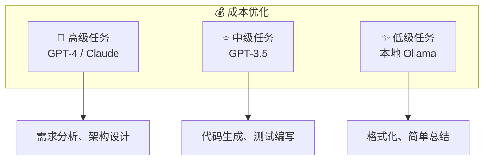

### 3. 记忆压缩

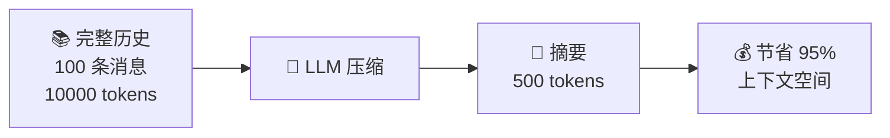

### 4. 消息过滤

```python
# 每个角色只处理相关消息，而非所有消息
async def _observe(self):
    news = self.rc.msg_buffer.pop_all()
    # 只保留匹配 watch 的消息
    news = [msg for msg in news if msg.cause_by in self.rc.watch]
    return len(news)
```

---

## 12.7 🗺️ 源码导读地图

想要深入研究源码？以下是推荐的阅读顺序：

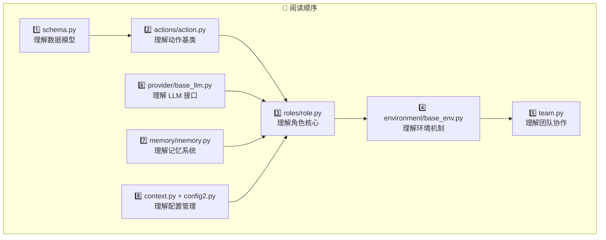

### 关键文件速查

| 文件 | 核心内容 |
|------|---------|
| `schema.py` | Message, Document, Plan, Task 等数据模型 |
| `roles/role.py` | Role, RoleContext, ReactMode 角色核心 |
| `actions/action.py` | Action 基类 |
| `actions/action_node.py` | ActionNode 结构化输出 |
| `environment/base_env.py` | Environment 消息路由 |
| `team.py` | Team 团队管理 |
| `provider/base_llm.py` | BaseLLM 抽象接口 |
| `memory/memory.py` | Memory 短期记忆 |
| `context.py` | Context 全局上下文 |

> 💡 **提示**：以上文件路径均在 `metagpt/` 目录下，建议直接查阅源码以获取最新信息。

---

## 12.8 📝 本章小结

### MetaGPT 的核心设计原则

| 原则 | 说明 | 体现 |
|------|------|------|
| **SOP 驱动** | 标准流程保证质量 | 软件公司工作流 |
| **角色分工** | 专业的人做专业的事 | ProductManager, Engineer 等 |
| **消息驱动** | 松耦合的异步通信 | publish-subscribe 机制 |
| **可扩展** | 开放封闭原则 | 继承 + Mixin + 注册表 |
| **成本控制** | 预算管理 + 分级模型 | CostManager + 多模型 |

### 设计模式总结

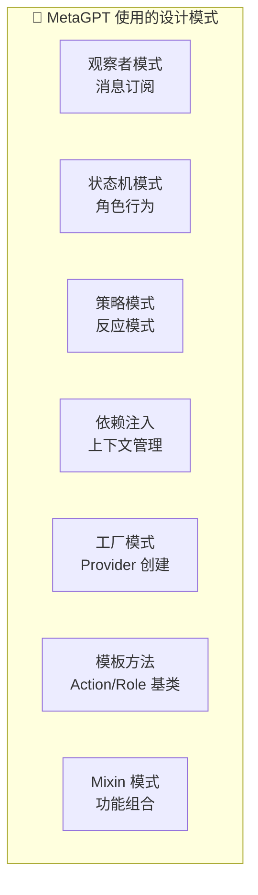

---

## 🎓 教程总结

恭喜你完成了 MetaGPT 的全部教程！让我们回顾一下学习路径：

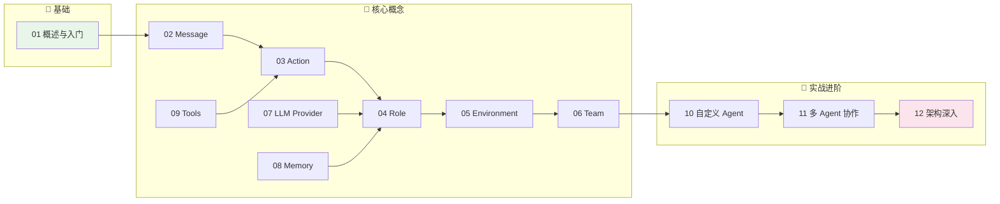

### 你现在能做什么？

- ✅ 理解 MetaGPT 的核心架构和设计哲学
- ✅ 创建自定义 Action 和 Role
- ✅ 构建多智能体协作系统
- ✅ 配置和使用不同的 LLM Provider
- ✅ 理解消息路由和记忆机制
- ✅ 阅读和理解 MetaGPT 源码

### 下一步建议

1. 📖 阅读 MetaGPT 源码，加深理解
2. 🛠️ 动手实现自己的多智能体项目
3. 🤝 参与 MetaGPT 社区，贡献代码
4. 📚 阅读 MetaGPT 的学术论文，了解研究背景

> 🌟 **记住**：最好的学习方式就是**动手实践**！祝你在多智能体的世界中探索愉快！
