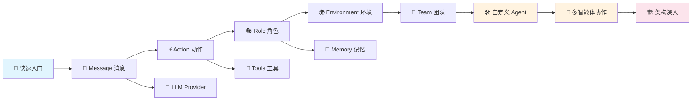

# 📚 MetaGPT 教程 - 由浅入深掌握多智能体框架

> 🎯 本教程旨在帮助你从零开始，逐步掌握 MetaGPT 多智能体协作框架。无论你是 AI 初学者还是有经验的开发者，都能在这里找到适合自己的学习路径。

---

## 🌟 MetaGPT 是什么？

**MetaGPT** 是一个多智能体协作框架，它的核心理念是：

> **Code = SOP(Team)** — 将标准化操作流程（SOP）融入多智能体协作中

简单来说，MetaGPT 让多个 AI 智能体（Agent）扮演不同角色（如产品经理、架构师、工程师等），像一个真实的软件公司一样协作完成复杂任务。

---

## 📖 教程目录

本教程分为三大部分：**基础入门** → **核心概念** → **实战进阶**

### 🌱 第一部分：基础入门

| 章节 | 内容 | 难度 |
|------|------|------|
| [01. MetaGPT 概述与快速入门](./01-overview-and-quickstart.md) | 项目介绍、安装配置、第一个程序 | ⭐ |

### 🌿 第二部分：核心概念

| 章节 | 内容 | 难度 |
|------|------|------|
| [02. Message 消息系统](./02-message-system.md) | 消息结构、路由机制、通信基础 | ⭐⭐ |
| [03. Action 动作系统](./03-action-system.md) | 动作定义、ActionNode、结构化输出 | ⭐⭐ |
| [04. Role 角色系统](./04-role-system.md) | 角色生命周期、状态机、反应模式 | ⭐⭐⭐ |
| [05. Environment 环境与通信](./05-environment-system.md) | 环境管理、消息路由、并发执行 | ⭐⭐⭐ |
| [06. Team 团队协作](./06-team-system.md) | 团队组建、预算管理、执行循环 | ⭐⭐ |
| [07. LLM Provider 大模型接入](./07-llm-provider.md) | 多模型支持、配置方法、Provider 架构 | ⭐⭐ |
| [08. Memory 记忆系统](./08-memory-system.md) | 短期记忆、长期记忆、记忆检索 | ⭐⭐⭐ |
| [09. Tools 工具系统](./09-tools-system.md) | 工具注册、搜索引擎、浏览器集成 | ⭐⭐ |

### 🌳 第三部分：实战进阶

| 章节 | 内容 | 难度 |
|------|------|------|
| [10. 实战：构建自定义 Agent](./10-build-custom-agent.md) | 从零创建智能体、自定义 Action | ⭐⭐⭐ |
| [11. 实战：多智能体协作](./11-multi-agent-collaboration.md) | 辩论系统、软件公司模拟 | ⭐⭐⭐⭐ |
| [12. 进阶：架构设计与原理](./12-architecture-deep-dive.md) | 设计哲学、架构全景、源码解析 | ⭐⭐⭐⭐⭐ |

---

## 🗺️ 学习路线图

---

## 🎯 适合谁阅读？

- 🧑‍💻 **AI 应用开发者** — 想要构建多智能体应用
- 🎓 **AI 研究者** — 想了解多智能体协作的工程实现
- 🏢 **技术团队** — 评估和使用 MetaGPT 框架
- 📖 **AI 爱好者** — 对大模型应用感兴趣的学习者

## 📋 前置知识

- ✅ 基础 Python 编程能力
- ✅ 了解大语言模型（LLM）的基本概念
- ✅ 了解 async/await 异步编程（推荐，非必须）

## 💡 学习建议

1. **跟着顺序学** — 教程按照依赖关系编排，建议按顺序阅读
2. **动手实践** — 每章都有代码示例，建议实际运行
3. **理解原理** — 不要只记 API，要理解「为什么这么设计」
4. **对比思考** — 将 MetaGPT 的设计与现实世界的团队协作对比

---

> 📝 **声明**：本教程基于 MetaGPT v1.0.0 编写。如有更新，请参考[官方文档](https://docs.deepwisdom.ai/)。

> 🤝 **贡献**：欢迎提交 Issue 或 PR 来完善本教程！
